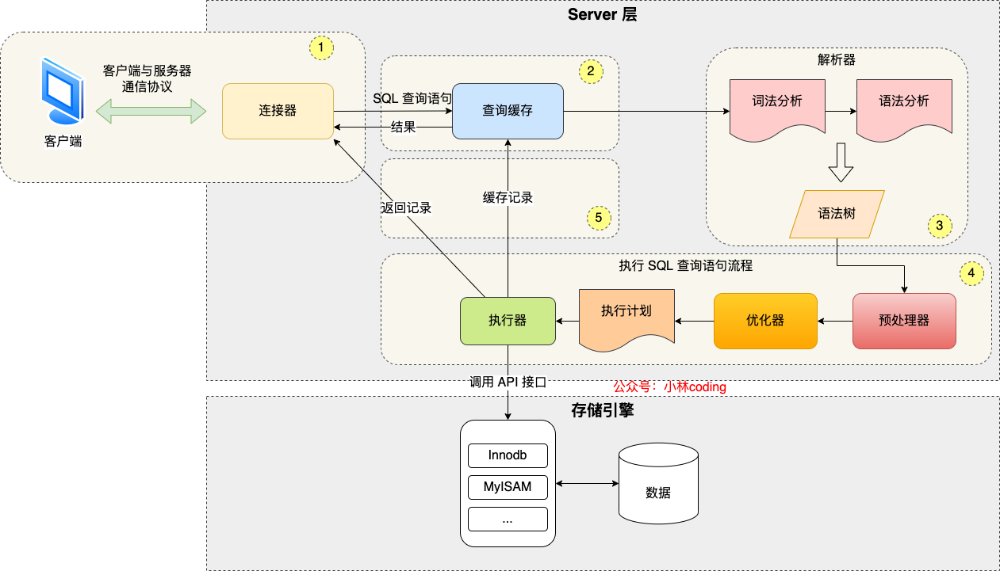

# Mysql


#### SQL语句

1. **索引语句：**ALTER TABLE t ==ADD/DORP== ==INDEX== index_name (column_list);

- 主键索引：`ALTER TABLE t ADD PRIMARY KEY (column_list);`
- 唯一索引：`ALTER TABLE t ADD UNIQUE index_name (column_list);`
- 普通索引：`ALTER TABLE t ADD INDEX index_name (column_list); `
- 全文索引：`ALTER TABLE t ADD FULLTEXT index_name (column_list);`

2. **查询语句：**

```sql
SELECT DISTINCT <select_list>
FROM <left_table> <join_type> JOIN <right_table> ON <on_predicate>
WHERE <where_predicate>
GROUP BY <group_by_specification>
HAVING <having_predicate>
ORDER BY <order_by_list>
LIMIT n, m;

处理顺序：FROM,ON,JOIN,WHERE,GROUP-BY,HAVING,SELECT,DISTINCT,ORDER-BY,LIMIT;
联表查询：
    a.交叉链接(笛卡尔积) cross join
    b.内链接 inner join-交集  NATURAL JOIN-交集
    c.外链接 left outer join、full outer join-并集、right outer join
    d.合并结果集：UNION、UNION ALL
```


架构图



常用Sql语句

创建表

删除表

修改表


innodb默认是主键索引是聚集索引


最左前缀原则


联合索引的最左匹配原则会一直向右匹配直到遇到范围查询(<、>) 时停止匹配，开始遍历联合索引叶子结点。


explain命令


事务的特性ACID：原子性、一致性、隔离型、持久性