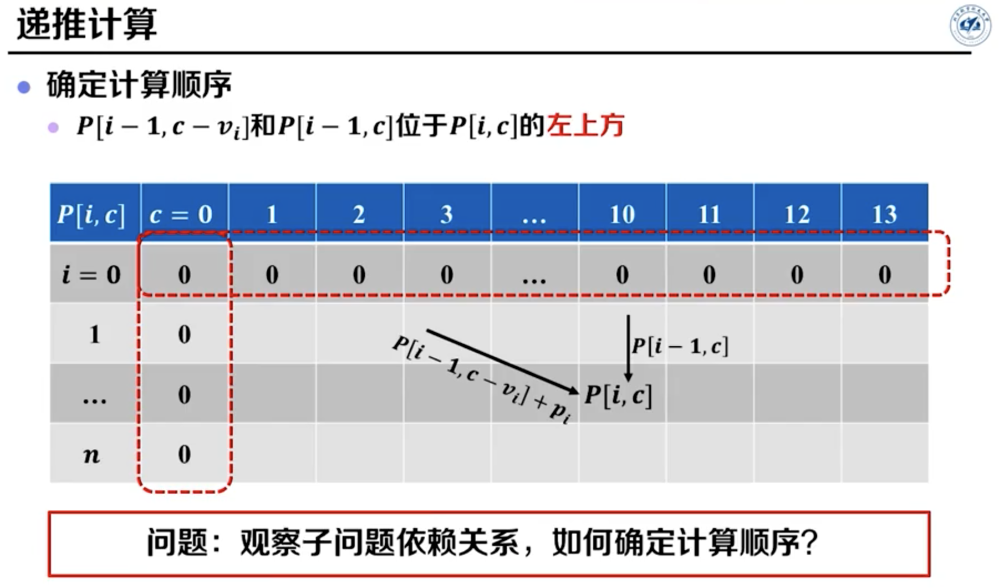
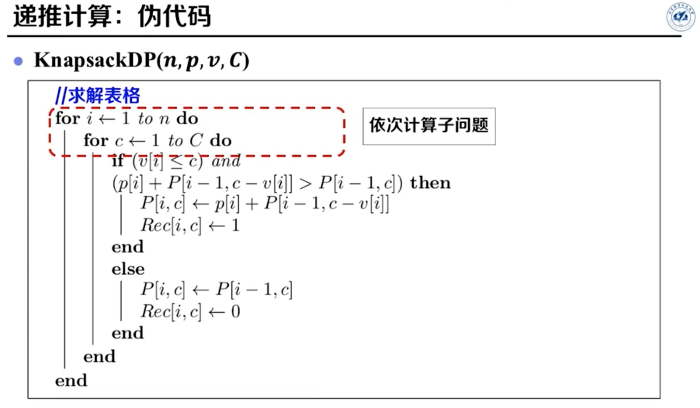
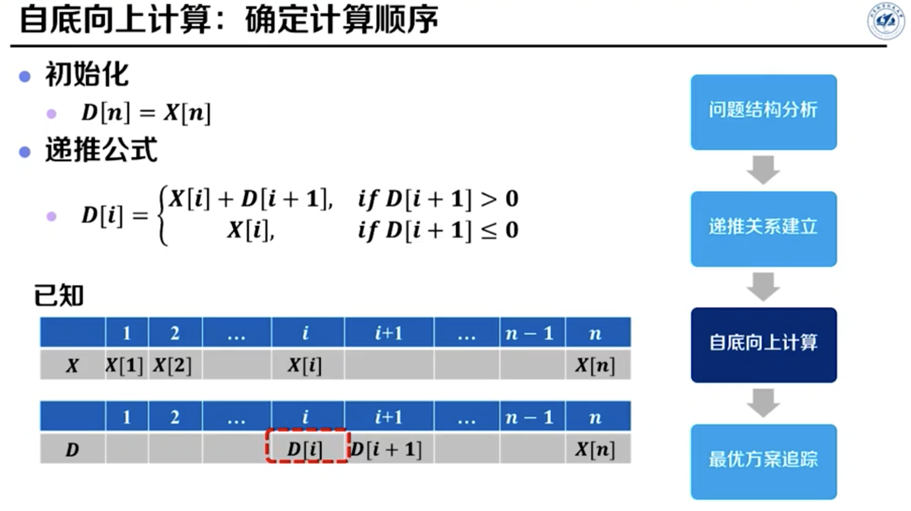
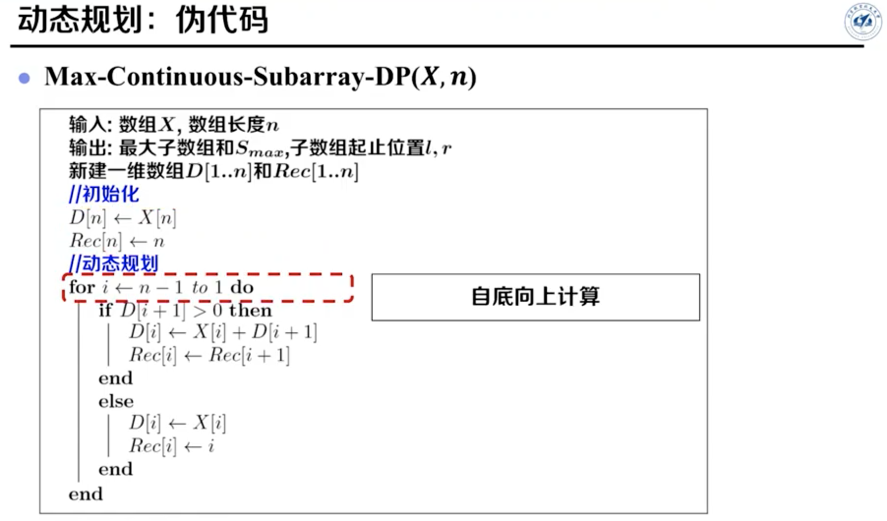
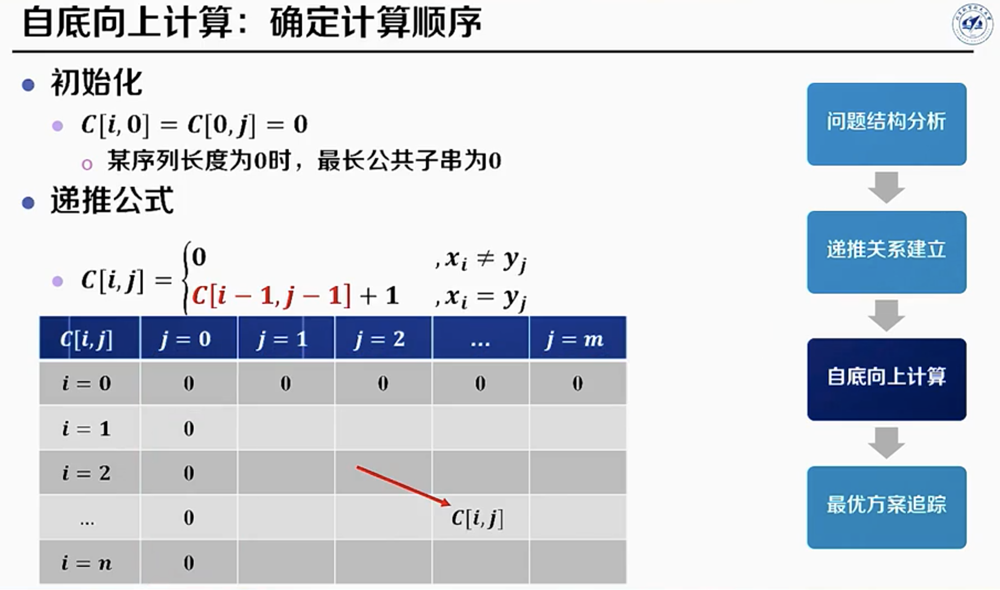
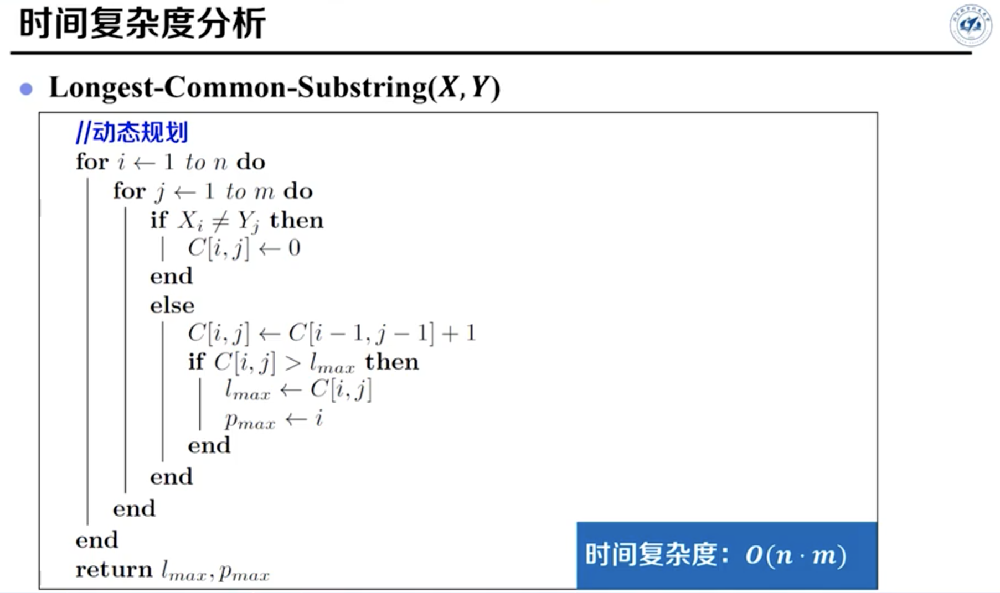
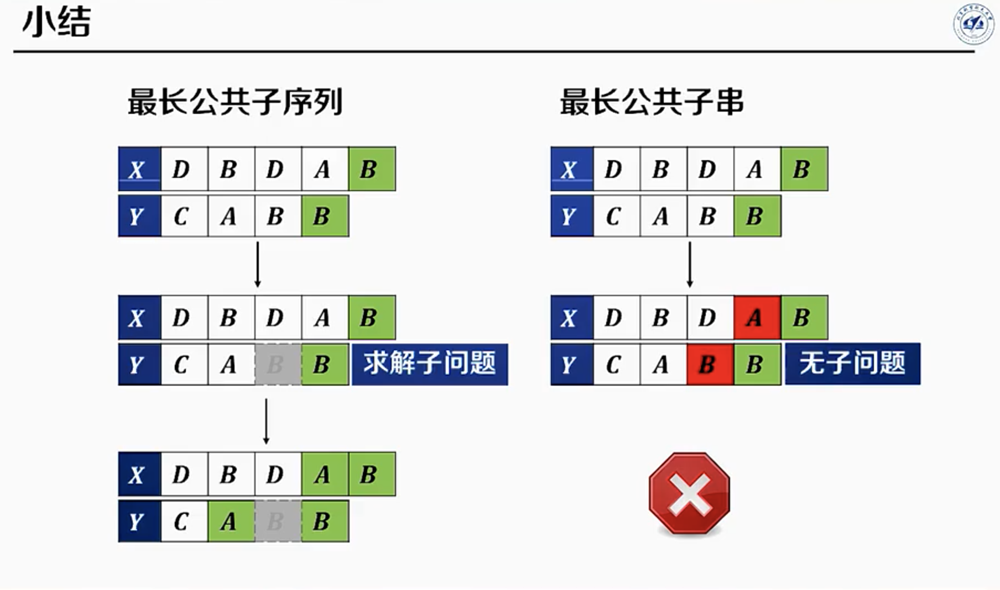

## 动态规划

#### 问题特征

> 最优子结构性质：问题的最优解由相关子问题最优解组合而成，子问题可以独立求解。

1. 要求==最优解==
2. 大问题能分解成==子问题==
3. 子问题间存在==重叠的子问题==

#### 解决步骤

> 简要步骤：[定义子问题](子问题其实就是小规模的状态，转移的时候通过转移方程从小规模转移的大规模；定义子问题时的窍门是恰当的使小问题能转移到大问题)、[确定转移方程](动态规划的精髓在于转移方程，在于前一状态已是最优解，计算这一状态时在可行解中选出最优解)、确定初始状态

1. 递归枚举：画出递归树，找到重复计算/子问题
2. 剪枝：确定转移方程，缓存中间结果
3. 递归改迭代：确定初始状态，自下而上求解

#### 时空复杂度

时间复杂度：从 递归的指数级 降成了 动态规划的O(n^2^)或O(n)

空间复杂度：O(n)，不需要方案追踪时，可通过滚动变量优化为O(1)

#### 贪心算法

与贪心算法区别：贪心算法是基于数学证明了一个贪心规则，每步都进行贪心选择时，可使整体最优。

#### 分治算法

与分治算法区别：动态规划的子问题是重叠子问题，而分治算法的子问题可能是独立的（如快速排序）。

#### 数学归纳法

与数学归纳法关系

#### 例题：剪绳子

> 题目：给你一根长度为 n 的绳子，请把绳子剪成整数长度的 m 段（m、n都是整数，n>1并且m>1），每段绳子的长度记为 k[0],k[1]...k[m-1] 。请问 k[0],k[1]...k[m-1] 可能的最大乘积是多少？例如，当绳子的长度是8时，我们把它剪成长度分别为2、3、3的三段，此时得到的最大乘积是18。

1. **动态规划可解的原因：**每个正整数对应的最大乘积取决于比它小的正整数对应的最大乘积

2. **动态规划解题步骤：**

   - **子问题：**dp[i] 表示将正整数 i 拆分成**至少两个**正整数的和之后，这些正整数的最大乘积

   - **转移方程：**dp[i] = max{ j × (i−j), j × dp[i−j] }, 1 ≤ j < i   （通过 j × (i−j) 包含了**不剪**的情况）

   - **初始状态：**dp[0] = dp[1] = 0

3. 时空复杂度：时间复杂度O(n^2^)，空间复杂度O(n)

```java
class Solution {
    public int cuttingRope(int n) {
        // 1 定义dp数组
        int[] dp = new int[n + 1];
        // 2 设置初始值
        dp[0] = dp[1] = 0;
        // 3 根据转移方程自下而上求解
        for (int i = 2; i <= n; i++) {
            // 3.1 设置子问题最优解的初始值
            int curMax = 0;
            // 3.2 计算子问题的解
            for (int j = 1; j < i; j++) { // j从1开始所以每个dp至少剪一刀
                // 3.3 转移方程（比较：最优解的历史值、各种情况产生的可行值）
                curMax = Math.max(curMax, Math.max(j * (i-j), j * dp[i-j]));
            }
            // 3.4 更新子问题最优解的当前值
            dp[i] = curMax;
        }
        // 返回最优解
        return dp[n];
    }
}

代码注释心得：
    行上注释：解释下一行/块代码
    行后注释：简单解释改行代码

1*i-1 1*dpi-1
2*i-2 2*dpi-2
3*i-3 3*dpi-3
    ...
i-1*1 i-1*dp1
```

#### 例题：0-1背包问题

> 题目的形式化定义：
>
> **输入：**$n$个商品组成集合$O$，每个商品有两个属性$V_i$和$p_i$，分别表示体积和价格，背包容量为C
>
> **输出：**求解一个商品子集$S \subseteq O$，令 $\max \sum \limits _{i \in S} p_i$ （优化目标），$s.t. \sum \limits _{i \in S} v_i \le C$ （约束条件）
>
> [参考北航算法设计与分析课程](https://www.bilibili.com/video/BV1TC4y1W7wC?p=19)

1. **动态规划可解的原因：**精髓在于转移方程，在于前一状态已是最优解，计算这一状态时选择物品放不放入背包
2. **动态规划解题步骤：**
   - 子问题：$P(i, c)$ 为前 $i$ 个商品中，容量为 $c$ 时的最优解
   - 转移方程：$P(i, c)=max\{P(i-1, c-v_i) + p_i,\ P(i-1, c)\}$，选择物品放不放入背包
   - 初始状态：$P(x,0)=0, \ P(0,y)=0$
3. 时空复杂度：时间复杂度O(nc)，空间复杂度O(n)





#### 例题：最大子数组和

> **题目：**给你一个整数数组 `nums` ，找出一个具有最大和的非空连续子数组，返回其最大和。
>
> 例如，输入nums = [-2,1,-3,4,-1,2,1,-5,4]，输出6。解释：连续子数组 [4,-1,2,1] 的和最大，为 6 。
>
> **形式化定义：**
>
> - 输入：给定一个数组$X[1…n]$，对于任意一对数组下标为$l,r(l \le r)$ 的非空子数组，其和记为$S(l,r)=\sum \limits ^r_{i=l} X[i]$
> - 输出：求出$S(l,r)$的最大值，记为$S_{max}$

> 子数组与子序列的区别在于元素在原数组/原序列中是否连续，子数组必须连续，子序列不必连续：
>
> - 子序列：将给定序列中零个或多个元素去掉后所得的结果
> - 子串：给定序列中零个或多个连续的元素组成的子序列
> - 子数组：序列为数组时的子串（数组和序列都可以叫做串）

1. **几种解法：**

   - 蛮力枚举：三层枚举 = 枚举开头 + 枚举结尾 + 枚举求和，时间复杂度O(n^3^)

   - 动态规划：可解原因为，时空复杂度O(n)，空间复杂度O(n)或O(1)

2. **蛮力枚举：**三层枚举 = 枚举开头 + 枚举结尾 + 枚举求和

2. **动态规划解法一（固定结尾，转移开头，必须有开头）：**
- 子问题：$D(i)$ 为以 $X[i]$ <font color="red">开头</font>的「连续子数组的最大和」，则最优解为 $\max \limits_{1 \le i \le n} \{D(i)\}$，（从1开始计数）
  
- 转移方程：$D(i)=\begin{cases}
                 X[i] \textcolor{red}{+} D(i+1), &if \ D(i+1) \gt 0 \\
                 X[i], &if \ D(i+1) \le 0 
              \end{cases}$
   
- 初始状态：$D(n) = X[n]$





3. **动态规划解法二（固定开头，转移结尾，必须有结尾）：**
   - 子问题：$F(i)$ 代表以 $X[i]$ <font color="red">结尾</font>的「连续子数组的最大和」，则最优解为 $\max \limits_{0 \le i \le n-1} \{F(i)\}$，（从0开始计数）
   - 转移方程1：$F(i)=\begin{cases}
         X[i] + F(i-1), &if \ F(i-1) > 0 \\
         X[i], &if \ F(i-1) ≤ 0 
      \end{cases}$
   - 转移方程2：$F(i)=\max\{F(i−1)+X[i], \ X[i]\}$，转移时考虑 $X[i]$ 单独成为一段还是加入 $F(i−1)$ 对应的那一段
   - 初始状态：$F(0)=X(0)$

```java
// 第一版
public class Solution {
    public int maxSubArray(int[] nums) {
        int len = nums.length;
        // dp[i] 表示：以 nums[i] 结尾的连续子数组的最大和
        int[] dp = new int[len];
        dp[0] = nums[0];
        for (int i = 1; i < len; i++) {
            if (dp[i - 1] > 0) {
                dp[i] = dp[i - 1] + nums[i];
            } else {
                dp[i] = nums[i];
            }
        }
        // 也可以在上面遍历时求 res 的最大值，这里我们为了语义清晰分开写，大家可以自行选择
        int res = dp[0];
        for (int i = 1; i < len; i++) {
            res = Math.max(res, dp[i]);
        }
        return res;
    }
}
// 第二版
class Solution {
    public int maxSubArray(int[] nums) {
        int pre = 0, maxAns = nums[0];
        for (int x : nums) {
            pre = Math.max(pre + x, x);
            maxAns = Math.max(maxAns, pre);
        }
        return maxAns;
    }
}
```

#### 例题：最长递增子序列

> 题目：给你一个整数数组 $X$，找到其中最长严格递增子序列的长度。
>
> 例如，输入 $X$ = [10,9,2,5,3,7,101,18]，输出4。解释：最长递增子序列是 [2,3,7,101]，长度为 4 。

1. **动态规划可解的原因：**每个正整数对应的最大乘积取决于比它小的正整数对应的最大乘积
2. 两种动态规划解法：开头、结尾
3. **动态规划解法一（必须有<font color="red">开头</font>）：**
   - **子问题：**$D[i]$ 表示以第 $i$ 个数开头的「最长递增子序列长度」，最优解为$\max \limits_{1 \le i \le n} \{D(i)\}$
   - **转移方程：**$D[i]=\max (D[j])+1, \ 若 \ X[i]<X[j] \ 其中 \ i<j≤n$
   - **初始状态：**$D[n] = 1$
4. **动态规划解法二（必须有<font color="red">结尾</font>）**：
   - **子问题：**$D[i]$ 表示以第 $i$ 个数结尾的「最长递增子序列长度」，最优解为$\max \limits_{0 \le i \le n-1} \{D(i)\}$
   - **转移方程：**$D[i]=\max (D[j])+1, \ 若 \ X[j]<X[i] \ 其中 \ 0≤j<i $
   - **初始状态：**$D[0] = 1$
5. 时空复杂度：时间复杂度O(n^2^)，空间复杂度O(n)

```java
动态规划解法二（必须有结尾）的代码实现：
class Solution {
    public int lengthOfLIS(int[] nums) {
        if (nums.length == 0) return 0;
        int[] dp = new int[nums.length];
        dp[0] = 1;
        int maxans = 1;
        for (int i = 1; i < nums.length; i++) {
            dp[i] = 1;
            // 这一层循环结合nums[i] > nums[j]实现了子序列
            for (int j = 0; j < i; j++) {
                if (nums[i] > nums[j]) {
                    // 算法中的转移方程和实现的代码语句也有不同
                    dp[i] = Math.max(dp[i], dp[j] + 1);
                }
            }
            maxans = Math.max(maxans, dp[i]);
        }
        return maxans;
    }
}
```

#### 例题：最长公共子串

> 题目：给定两个整数数组 $X[0..n-1]$ 和 $Y[0..m-1]$ ，返回公共的、长度最长的子数组的长度 。

1. 几种解法：

   - 暴力枚举：枚举X开头+枚举Y开头+枚举比对，时间复杂度O(n^3^)
   - 动态规划-转移开头
   - 动态规划-转移结尾

2. 动态规划解题步骤（转移结尾）：

   - **子问题：**$C[i,j]$ 表示以 $x_i$ 和 $y_j$ 结尾的「最长公共子串的长度」，最优解为$\max \limits_{0≤i≤n-1, \ 0≤j≤m-1} \{C(i,j)\}$

   - **转移方程：**$D(i)=\begin{cases}
         0, & x_i ≠ y_j \\
         C[i-1, \ j-1]+1, & x_i = y_j
      \end{cases}$

   - **初始状态：**$C[i,0]=C[0,j]=0$，某串/数组长度为0时，无公共子串/数组





```java
// 转移开头的代码实现
class Solution {
    public int findLength(int[] A, int[] B) {
        int n = A.length, m = B.length;
        int[][] dp = new int[n + 1][m + 1];
        int ans = 0;
        for (int i = n - 1; i >= 0; i--) {
            for (int j = m - 1; j >= 0; j--) {
                dp[i][j] = A[i] == B[j] ? dp[i + 1][j + 1] + 1 : 0;
                ans = Math.max(ans, dp[i][j]);
            }
        }
        return ans;
    }
}
```

#### 例题：最长公共子序列

> 给定两个字符串 $X$ 和 $Y$，返回这两个字符串的最长公共子序列的长度。若不存在则返回 0 。
>

- **子问题：**$C[i,j]$ 表示 $X[0..i]$ 和 $Y[0..j]$ 的「最长公共子序列的长度」，最优解为$C(n-1,m-1)$ [^1]

- **转移方程：**$D(i)=\begin{cases}
      \max \{ C[i-1,j], \ C[i,j-1] \}, & x_i ≠ y_j \\
      C[i-1,j-1]+1, & x_i = y_j
   \end{cases}$

- **初始状态：**$C[i,0]=C[0,j]=0$，某串/数组长度为0时，无公共子串/数组
- 时空复杂度：时间复杂度：O(mn)，空间复杂度O(mn)

```java
class Solution {
    public int longestCommonSubsequence(String text1, String text2) {
        int m = text1.length(), n = text2.length();
        int[][] dp = new int[m + 1][n + 1];
        for (int i = 1; i <= m; i++) {
            char c1 = text1.charAt(i - 1);
            for (int j = 1; j <= n; j++) {
                char c2 = text2.charAt(j - 1);
                if (c1 == c2) {
                    dp[i][j] = dp[i - 1][j - 1] + 1;
                } else {
                    dp[i][j] = Math.max(dp[i - 1][j], dp[i][j - 1]);
                }
            }
        }
        return dp[m][n];
    }
}
```



#### 例题：爬楼梯、零钱兑换

> **爬楼梯：**假设你正在爬楼梯，一次能爬 1 或 2 级台阶，问爬完 n 级台阶共有多少种走法？
>
> **最小花费爬楼梯：**给定一个整数数组 cost ，其中 cost[i] 表示从第 i 级台阶向上爬需要支付的费用，一旦你支付此费用，即可选择向上爬一级或者两级台阶。可以选择从下标为 `0` 或下标为 `1` 的台阶开始爬楼梯。问爬完 n 级台阶的最小花费是多少？
>
> **零钱兑换：**有面值为1元、3元和5元的硬币若干枚，问把 n 元兑换成的硬币的最少个数？
>
> **任意面值零钱兑换：**给定一个整数数组 coins[0..m] ，表示有不同面额的硬币，问把 n 元兑换成的硬币的最少个数？
>
> **任意面值零钱兑换 II ：**给定一个整数数组 coins[0..m] ，表示有不同面额的硬币，问把 n 元兑换成硬币有多少种组合？

- 本质是斐波那契数列：$D[i]=\begin{cases}
     				          i, & 0≤i≤1 \\
                            D[i-1]+D[i-2], & i>1
                         \end{cases}$
- 爬楼梯：转移方程同斐波那契数列公式
- 最小花费爬楼梯：$D[i]=\begin{cases}
                            cost[0], & i=0,1 \\
                            \min \{cost[0], \ cost[0]+cost[1]\}=cost[0], & i=2 \\    
                            \min \{(D[i-1]+cost[i-1]), \ (D[i-2]+cost[i-2])\}, & i>2
                         \end{cases}$
- 凑硬币：$D[i]=\begin{cases}
                  D[1]=1, \ D[2]=3, \ D[3]=1, \ D[4]=2, \ D[5]=1 & 1≤i≤5 \\  
                  \min \{D[i-1], \ D[i-3], \ D[i-5]\} + 1, & i>5
               \end{cases}$
- 任意面值零钱兑换：$D[i]=\begin{cases}
                  1 , & 若i存在于coins数组中 \\  
                  \min \limits _{0≤j≤m-1} \{D[i-j]\} + 1, \ & 其中i-j<0的项直接忽略
               \end{cases}$
- 任意面值零钱兑换 II ：解法见下方代码块描述
  - 类似于爬楼梯：[参考题解](https://leetcode.cn/problems/coin-change-ii/solutions/143948/ling-qian-dui-huan-iihe-pa-lou-ti-wen-ti-dao-di-yo/)
  - 类似于0-1背包问题：选不选择这一硬币

```java
任意面值零钱兑换 II 动态规划的做法：
1. 初始化 dp[0]=1；
2. 遍历 coins，对于其中的每个元素 coin，进行如下操作：
    2.1 遍历 i 从 coin 到 amount，将 dp[i−coin] 的值加到 dp[i]
3. 最终得到 dp[amount]的值即为答案
   
    上述做法不会重复计算不同的排列。因为外层循环是遍历数组 coins 的值，内层循环是遍历不同的金额之和，在计算 dp[i] 的值时，可以确保金额之和等于 i 的硬币面额的顺序，由于顺序确定，因此不会重复计算不同的排列。
```

#### 例题：礼物的最大价值

> 在一个 m*n 的棋盘的每一格都放有一个礼物，每个礼物都有一定的价值（价值大于 0）。你可以从棋盘的左上角开始拿格子里的礼物，并每次向右或者向下移动一格、直到到达棋盘的右下角。给定一个棋盘及其上面的礼物的价值，请计算你最多能拿到多少价值的礼物？

- **子问题：**$D[i,j]$ 表示以 $X[i,j]$ 结尾的子棋盘的「礼物最大价值」，最优解为$\max \limits _{0≤i≤n-1,0≤j≤m-1} D[i,j]$

- **转移方程：**$D[i,j]=\max[D(i,j−1), \ D(i−1,j)]+X(i,j)$

- **初始状态：**$D[0,0]=X[0,0]$，**返回值：**$D[n−1,m-1]$

- 技巧：这样写dp数组`int[] dp = new int[n,m]`，然后`i`和`j`从$1$开始计数，这样算`n-1`时不越界

```java
  class Solution {
      public int maxValue(int[][] grid) {
          int m = grid.length, n = grid[0].length;
          int[][] f = new int[m][n];
          for (int i = 0; i < m; ++i) {
              for (int j = 0; j < n; ++j) {
                  if (i > 0) {
                      f[i][j] = Math.max(f[i][j], f[i - 1][j]);
                  }
                  if (j > 0) {
                      f[i][j] = Math.max(f[i][j], f[i][j - 1]);
                  }
                  f[i][j] += grid[i][j];
              }
          }
          return f[m - 1][n - 1];
      }
  }
```

  

#### 例题：股票的最大利润

> 假设把某股票的价格按照时间先后顺序存储在数组中，请问买卖该股票一次可能获得的最大利润是多少？例如，输入: [7,1,5,3,6,4]，输出: 5。解释: 在第 2 天（股票价格 = 1）的时候买入，在第 5 天（股票价格 = 6）的时候卖出，最大利润 = 6-1 = 5 。注意利润不能是 7-1 = 6, 因为卖出价格需要大于买入价格。

- **子问题：**$D[i]$ 表示以 $X[i]$ 结尾的子数组的「最大利润」，即前 $i$ 日的最大利润，最优解为$\max \limits _{0≤i≤n-1} D[i]$

- **转移方程：**$D[i]=\max(D[i−1], \ prices[i]− \min \limits _{0≤j≤i}(prices[i]))$ [^2]，优化：[参考题解](https://leetcode.cn/problems/gu-piao-de-zui-da-li-run-lcof/solution/mian-shi-ti-63-gu-piao-de-zui-da-li-run-dong-tai-2/)

- **初始状态：**$D[0]=0$，即首日利润为 0，**返回值：**$D[n−1]$
- 时空复杂度：时间复杂度：O(n^2)，空间复杂度O(1)

```java
// 优化：使用变量暂存前i天最低价
int maxProfit(int[] prices) {
    int cost = Integer.MAX_VALUE, profit = 0;
    for(int price : prices) {
        cost = Math.min(cost, price);
        profit = Math.max(profit, price - cost);
    }
    return profit;
}
```

- 这道题更好的解法：一次遍历，遍历时记下最低价格和当前价格进行比较（时间O(n)，空间*O*(1)）

```java
// 一次遍历的代码实现
public int maxProfit(int prices[]) {
    int minprice = Integer.MAX_VALUE;
    int maxprofit = 0;
    for (int i = 0; i < prices.length; i++) {
        if (prices[i] < minprice) {
            minprice = prices[i];
        } else if (prices[i] - minprice > maxprofit) {
            maxprofit = prices[i] - minprice;
        }
    }
    return maxprofit;
}
```


#### 例题：每日温度

> 请根据每日 气温 列表 temperatures ，重新生成一个列表，要求其对应位置的输出为：要想观测到更高的气温，至少需要等待的天数。如果气温在这之后都不会升高，请在该位置用 0 来代替。

- **子问题：**$D[i]$ 表示以 $X[i]$ 开头的子数组第 $i$ 天的「气温升高等待天数」，最优解为$\max \limits _{0≤i≤n-1} D[i]$

- **转移方程：**$D(i)=\begin{cases}
      j-i, & X[i] > X[i+1], \ 其中\min \limits _{(i+1+D[i+1]) ≤ j ≤ (n-1)} j, \ 使得X[i] < X[j]\\
      D[i+1], & X[i] = X[i+1] \\
      1, & X[i] < X[i+1]\\
   \end{cases}$

- **初始状态：**$D[n-1]=0$
- 时空复杂度：时间复杂度：O(n^2)，空间复杂度O(1)
- 这道题更好的解法是**单调栈**:维护一个存储下标的单调栈，从栈底到栈顶的下标对应的温度依次递减。如果一个下标在单调栈里，则表示尚未找到下一次温度更高的下标。


[^1]: $C(n-1,m-1)=\max \limits_{0≤i≤n-1, \ 0≤j≤m-1} \{C(i,j)\}$​​​
[^2]: $前i日最大利润=max(前(i−1)日最大利润,\ 第i日价格−前i日最低价格)$​