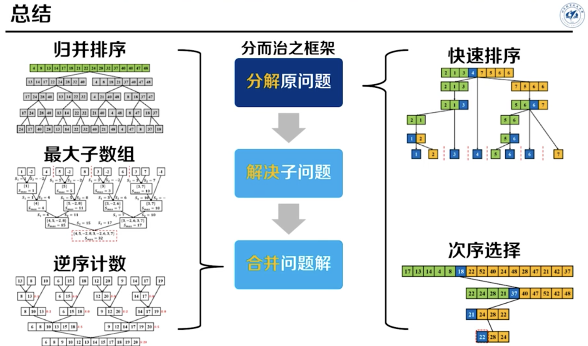

## 代码精粹

#### 通用技巧

```json
英文：进位-carry、中间-middle、包含-contain、反转-reverse
     单例-singleton
代码格式：1.入参边界判断; 2.中间逻辑; 3.返回result
Math.max()
变量命名：索引-ij，数学-xy，方向-left/right/top/bottom
continue
Integer.parseInt()
Character
```

#### 递归与迭代

```java
// 递归写法(求1～n的和)：
int addOneToN_Recursive(int n) {
     if (n <= 0) return 0;
     return addOneToN_Recursive(n-1);
}
// 对比迭代写法(求1～n的和)：
int addOneToN_Iterative(int n) {
     int result = 0;
     for (int i=0; i<=n; i++) {
          result += i;
     }
     return result;
}
// 递归代码模版
int recursive(int n) {
    if (递归终止条件) {return x}
    递归操作点1;
    int res = recursive(m);
    递归操作点2;
    return res;
}
```

#### 基本类型

```java
数字最值：int i = Integer.MAX_VALUE; // 2^32 -1
数字值溢出解决方法：大数求余解法(循环求余、快速幂求余)
```

#### 字符串

```java
s.length()
s.charAt(i)
Java语法糖：trim()、split（拆分），reverse（翻转）和 join（连接）
String.join(" ", wordList);
```

#### 数组

```java
1.声明数组变量：int[] arr;
2.创建数组：
    a. int[] arr = new int[length]; // 长度变量
	b. int[] arr = new int[] {1, 2, 3};
	c. int[] arr = {1, 2, 3}; // ?
	d. Arrays: fill, setAll, copyOf(arr, k); //复制前k个元素(0～k-1)
	e. Lists
    f. 多维数组：int[][] arr = new int[][] {{1,2,3}, {4,5,6}};
3.数组长度：arr.length; // 区别于 list.size()
4.数组语法糖：
5.Arrays类：fill, sort, binarySearch, equals等等
6.数组和列表互转：
7.数组转字符串：String str = String.join(",", arr); // arr为字符串数组
8.字符串转数组：String[] arr = str.split(",");

遍历数组：
for (int i = 0; i < arr.length; i++) {} // 从0开始遍历到length-1，共循环length次
for (int i = 1; i <= arr.length; i++) {} // i = length 时，数组访问会越界

遍历二维数组（遍历矩阵）：
private static List<Integer> spiralOrder(int[][] matrix) {
    LinkedList<Integer> result = new LinkedList<>();
    if(matrix==null||matrix.length==0) return result;
    int left = 0;
    int right = matrix[0].length - 1;
    int top = 0;
    int bottom = matrix.length - 1;
    int numEle = matrix.length * matrix[0].length;
    while (numEle >= 1) {
        for (int i = left; i <= right && numEle >= 1; i++) {
            result.add(matrix[top][i]);
            numEle--;
        }
        top++;
        for (int i = top; i <= bottom && numEle >= 1; i++) {
            result.add(matrix[i][right]);
            numEle--;
        }
        right--;
        for (int i = right; i >= left && numEle >= 1; i--) {
            result.add(matrix[bottom][i]);
            numEle--;
        }
        bottom--;
        for (int i = bottom; i >= top && numEle >= 1; i--) {
            result.add(matrix[i][left]);
            numEle--;
        }
        left++;
    }
    return result;
}
```

#### 链表

```java
1.链表：dummy->head②->⑤->③->⑦->⑨->⑥->null
2.链表指针名：dummy-哑节点、head-头节点、prev-前一指针、p-遍历指针
3.链表操作要区分:
	a. p = head; // p 等价于 head 节点
    b. p.next = head // p 指向 head节点
    c. p = head.next // p 等价于 head 的子节点
        
// 遍历链表
Node p = head; // 创建遍历指针(非空头)
while (p != null) { // 遍历指针判尾
    // do somthing
    p = p.next; // 遍历指针前进
}
// 复制链表
Node copyList(Node head) {
    if (head == null) return null;
    // 创建新链表dummy，并创建前一指针prev
    Node dummy = new Node(-1), prev = dummy;
    while (head != null) {
        prev.next = new Node(head.val);
        prev = prev.next;
        head = head.next;
    }
    return dummy.next; // 返回非空头
}
```

#### Java Set

```java

.contains()
.add()
```


#### Java List

```java
// 向有序列表中添加数字
void addNum(List data, int num) {
    for (int i = 0; i < data.size(); i++) {
        if (data.get(i) >= num) {
            data.add(i, num);
            return;
        }
    }
    data.add(num);
}
```

#### 栈

```java
栈(Stack)：
    a.不要使用遗留类Stack
    b.创建：Deque<Node> stack = new LinkedList();
	c.操作：push(E), E pop(), E peek();
```


#### 队列

```java
队列(Queue)
    a.创建：
    	i.ArrayDeque
    	ii.Queue<Node> queue = new LinkedList<>();
		iii.也可以用两个栈实现队列
	b.操作：offer(E), E poll(), E peek();
    
双端队列(Double Ended Queue)：
    a.创建：Deque<Node> deque = new LinkedList<>();
	b.操作：offerLast(E), offerFirst(E), E pollFirst(), E pollLast(), E peekFirst(), E peekLast();

优先队列
    a.创建：Queue<Integer> priorityQueue = new PriorityQueue<Integer>();
	b.操作：add poll peek ??

```


#### 二叉树

```java
二叉树
二叉排序树
平衡二叉树
红黑树
B数与B+数

遍历
```

#### 二分查找

```java
int binarySearch(int[] arr, int target) {
    if (arr == null || arr.length == 0) {
        return -1;
    }
    int left = 0, right = arr.length - 1;
    // <= +- 每次循环后区间范围一定会缩小
    while (left <= right) {
        int mid = (left + right) / 2;
        if (arr[mid] == target) {
            return mid;
        } else if (arr[mid] < target) {
            left = mid + 1;
        } else {
            right = mid - 1;
        }
    }
    // 数组中不存在目标值
    return -1;
}
```

#### 冒泡排序

```java
void bubbleSort(int[] arr) {
    // 外层循环条件 len-1，内层循环条件 len-1-i
    for (int i = 0; i < arr.length - 1; i++) {
        for (int j = 0; j < arr.length - 1 - i; j++) {
            if (arr[j] > arr[j + 1]) {
                int temp = arr[j];
                arr[j] = arr[j + 1];
                arr[j+1] = temp;
            }
        }
    }
}
```

#### 归并排序

```java
// 时间复杂度O(nlogn)
void mergeSort(int[] arr, int left, int right) {
    if (left < right) {
        int mid = (left + right) / 2;
        sort(arr, left, mid);
        sort(arr, mid + 1, right);
        merge(arr, left, mid, right);
    }   
}
void merge(int[] arr, int left, int mid, int right) {
    int temp[] = new int[right - left + 1];
    int i = left, j = mid + 1, k = 0;
    while (i <= mid && j <= right) {
        if (arr[i] < arr[j]) {
            temp[k] = arr[i];
            k++; i++;
        } else {
            temp[k] = arr[j];
            k++; j++;
        }
    }
    if (i < mid) {
        while (i <= mid) {
            temp[k] = arr[i];
            k++; i++;
        }
    } else {
        while (j <= right) {
            temp[k] = arr[j];
            k++; j++;
        }
    }
    for(int i = 0; i < temp.length; i++) {
        arr[left] = temp[i];
        left++;
    }
}
```

#### 快速排序

```java
// 期望时间复杂度O(nlogn)
void quickSort(int[] arr, int left, int right) {
    if (left < right) {
        int partitionIndex = partition(arr, left, right);
        quickSort(arr, left, partitionIndex - 1);
        quickSort(arr, partitionIndex + 1, right);
    }
}
int partition(int[] arr, int left, int right) {
    int pivot = arr[left++];
    while (left < right) {
        while (left < right && arr[right] >= pivot) right--;
        swap(arr, left, right);
        while (left < right && arr[left] <= pivot) left++;
        swap(arr, left, right);
    }
    arr[left] = pivot;
    return left;
}
int partition2(int[] arr, int left, int right) {
    int pivot = arr[right];
    int i = left - 1;
    for (int j = left; j < right; j++) {
        if (arr[j] <= pivot) {
            i++;
            swap(arr, i, j);
        }
    }
    swap(arr, i + 1, right);
    return i + 1;
}
```


####  KMP 算法

```java
int kmp(String str, String dest) {
    //1.首先计算出 部分匹配表
    int[] next = next(dest); //子串最长相同前后缀长度
    //2.查找匹配位置
    for (int i = 0, j = 0; i < str.length(); i++) {
        while(j > 0 && str.charAt(i) != dest.charAt(j)) {
            j = next[j - 1];
        }
        if (str.charAt(i) == dest.charAt(j)) {
            j++;
        }
        if (j == dest.length()) {
            return i - j + 1;
        }
    }
    return -1;
}
// 计算部分匹配表
int[] next(String dest) {
    int[] next = new int[dest.length()];
    next[0] = 0;
    for (int i = 1, j = 0; i < dest.length(); i++) {
        while (j > 0 && dest.charAt(j) != dest.charAt(i)) {
           // 不等时记录前一个的最长匹配长度
            j = next[j - 1];
        }
        if(dest.charAt(i) == dest.charAt(j)) {
            // 相等时继续往后比较，探寻最长匹配
            j++;
        }
        next[i] = j;
    }
    return next;
}
```

## 数据结构-数组

双指针有：左右(left-right)、前后(pre?prev-current/curr/p/i)、快慢指针

#### 盛最多水的容器

#### 原地删除有序数组中的重复项

> 题目：给定一个升序排列的数组 nums ，请你原地删除重复的元素，使每个元素只出现一次 ，返回删除后数组的新长度。

（原地即要求空间复杂度O(1)，通常意味着允许损失时间复杂度）

```java
int removeDuplicates(int[] nums) {
    if (nums == null || nums.length == 0) {
        return 0;
    }
    int prev = 0;
    for (int i = 1; i < nums.length; i++) {
        // 不等时该元素加入新数组，相等时过滤掉
        if (nums[prev] != nums[i]) {
            prev++;
            nums[prev] = nums[i];
        }
    }
    return prev + 1;
}
```

#### 删除有序数组中的重复项 II

> 题目：给定一个有序数组 nums ，请你原地删除重复出现的元素，使每个元素**最多出现两次** ，返回删除后数组的新长度。

```java
int removeDuplicates(int[] nums) {
    if (nums == null || nums.length == 0) {
        return 0;
    }
    int times = 1;
    int prev = 0;
    for (int i = 1; i < nums.length; i++) {
        if (nums[prev] != nums[i]) {
            times = 1;
            prev++;
            nums[prev] = nums[i];
        } else if (times == 1) {
            times++;
            prev++;
            nums[prev] = nums[i];
        } else {
            times++;
        }
    }
    return prev + 1;
}
```

## 数据结构-链表

```java
// **反转链表
Node reverseList(ListNode head) {
    if (head == null) {
        return null;
    }
    // 1.创建前一指针, 初始值是null
    Node prev = null; 
    while(head != null) {
        Node temp = head.next; // 2.暂存head.next
        head.next = prev; // 3.head反转指向前一节点
        prev = head; // 前一指针前进
        head = temp; // 当前指针head前进
    }
    return prev; // 此时prev等于原链表尾节点
}
// 深拷贝链表

// 相交链表的交点
public ListNode getIntersectionNode(ListNode headA, ListNode headB) {
    if (headA == null || headB == null) {
        return null;
    }
    ListNode pA = headA;
    ListNode pB = headB;
    while (pA != null || pB != null) {
        if (pA == null) {
            pA = headB;
        }
        if (pB == null) {
            pB = headA;
        }
        if (pA == pB) {
            return pA;
        }
        pA = pA.next;
        pB = pB.next;
    }
    return null;
}

// 合并两个有序链表-创建新链表
Node mergeList(Node head1, Node head2) {
    if (head1 == null) return head2;
    if (head2 == null) return head1;
    // 创建新链表dummy，并创建遍历指针p
    Node dummy = new Node(-1), p = dummy;
    Node p1 = head1, p2 = head2;
    while (p1 != null && p2 != null) {
        if (p1.val < p2.val) {
            p.next = new Node(p1.val);
            p1 = p1.next;
        } else {
            p.next = new Node(p2.val);
            p2 = p2.next;
        }
        p = p.next;
    }
    // 若未完，遍历完
    while (p1 != null) {
        p.next = new Node(p1.val);
        p1 = p1.next;
        p = p.next;
    }
    while (p2 != null) {
        p.next = new Node(p2.val);
        p2 = p2.next;
        p = p.next;
    }
    return dummy.next;
}
```

#### 计数链表

```java
int size = 0;
Node p = head; // 非空头
while (head != null) {
    size++;
    p = p.next;
}
```

#### 链表倒数第K个元素

#### 环形链表的环口

> [题目](https://leetcode.cn/problems/c32eOV/)：给定一个链表，返回链表开始入环的第一个节点。 从链表的头节点开始沿着 `next` 指针进入环的第一个节点为环的入口节点。如果链表无环，则返回 `null`。

**解法一：HashSet**

```java
// 遍历链表时借助哈希表记录走过的节点，遇到重复节点即环口
ListNode detectCycle(Node head) {
    if (head == null) return null;
    Node p = head;
    Set<Node> visited = new HashSet<Node>();
    while (p != null) {
        if (visited.contains(pos)) {
            return p;
        } else {
            visited.add(pos);
        }
        p = p.next;
    }
    return null;
}
```

**解法二：快慢指针**

```java
// 1. 快指针两倍速于慢指针遍历链表
// 2. 相遇后快指针重置到head并与慢指针同速走
// 3. 再次相遇即环口
Node detectCycle(Node head) {
    if (head == null) return null;
    Node slow = head, fast = head;
	do {
        if (fast == null || fast.next == null) {
            return null;
        }
        slow = slow.next;
        fast = fast.next.next;
    } while (slow != fast);
    fast = head;
    while (fast != slow) {
        fast = fast.next;
        slow = slow.next;
    }
    return slow;
}
```

#### 重排链表

> **题目：**给定一个单链表 `L` 的头节点 `head` ，单链表 `L` 表示为：L0 → L1 → … → Ln - 1 → Ln
>
> 
> 请将其重新排列后变为：L0 → Ln → L1 → Ln - 1 → L2 → Ln - 2 → …
> 
>
> 不能只是单纯的改变节点内部的值，而是需要实际的进行节点交换。

解法一：加载进数组中，然后利用下标重排

解法二：找到中点，后半截逆序，然后合并两列表

#### 排序链表

> [题目](https://leetcode.cn/problems/sort-list/description/)：给你链表的头结点 head ，请将其按升序排列并返回排序后的链表。

- 解法一：递归式归并排序 
  - 算法复杂度：时间O(nlogn)，空间 O(logn)，空间消耗在递归上
- 解法二：迭代式归并排序
  - 算法复杂度：时间O(nlogn)，空间 O(1)
- 解法三：快速排序
  - 算法复杂度：时间O(nlogn)，空间 ？

## 数据结构-二叉树

#### 前中后序遍历

```java
// 递归式
```

#### 层序遍历

```java
public List<List<Integer>> levelOrder(TreeNode root) {
    if (root == null) {
        return new ArrayList();
    }
    List<List<Integer>> result = new ArrayList();
    Queue<TreeNode> level = new LinkedList();
    level.offer(root);
    while (level.size() > 0) {
        List<Integer> levelResult = new ArrayList();
        int levelSize = level.size();
        for (int i = 0; i < levelSize; i++) {
            TreeNode node = level.poll();
            levelResult.add(node.val);
            if (node.left != null) {
                level.offer(node.left);
            }
            if (node.right != null) {
                level.offer(node.right);
            }
        }
        result.add(levelResult);
    }
    return result;
}
```

#### 二叉树的最近公共祖先

```java
题目：给定一个二叉树, 找到该树中两个指定节点的最近公共祖先。
```

解法一：

解法二：哈利表存储所有节点的父节点

## 二分查找问题

## 分治算法问题



#### 归并排序

- 递归式
- 迭代式

#### 快速排序

#### 最大子数组和

> **题目：**给你一个整数数组 `nums` ，找出一个具有最大和的非空连续子数组，返回其最大和。

**解法一：蛮力枚举**

**解法二：分治算法**

- 关键是中间跨区间的计算

**解法三：动态规划？？**

#### 逆序对计数问题-归并排序应用

**解法一：蛮力枚举**

- 枚举开头，枚举结尾；时间复杂度o(n^2^)

**解法二：分治算法+归并排序**

#### 第K大/小问题-快速排序应用

**解法一：蛮力枚举**

**解法二：快速选择**

- 最好时间复杂度O(n)，期望时间复杂度O(n)，最坏时间复杂度O(n^2^)，空间复杂度

```java
快速选择代码实现：
```
