# 网络通信

#### 网络通信模型

- OSI七层模型：物理层、数据链路层、网络层、传输层、会话层、表示层、应用层
- TCP/IP四层模型：应用层、传输层、网络层、网络接口层（数据链路层）

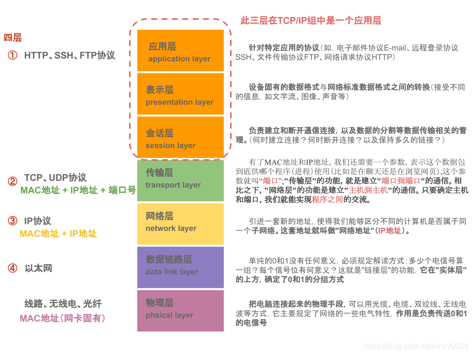

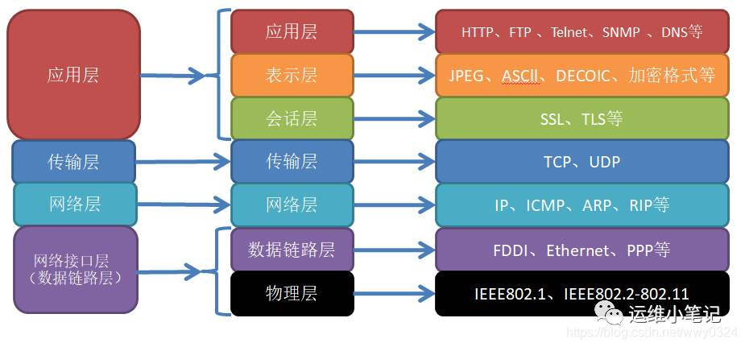

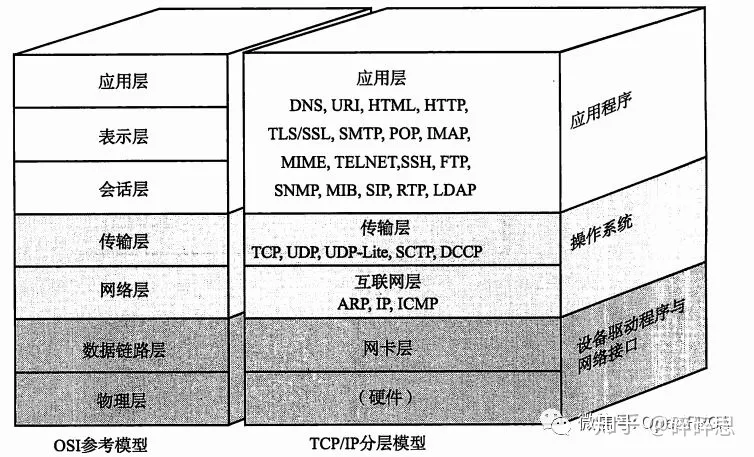

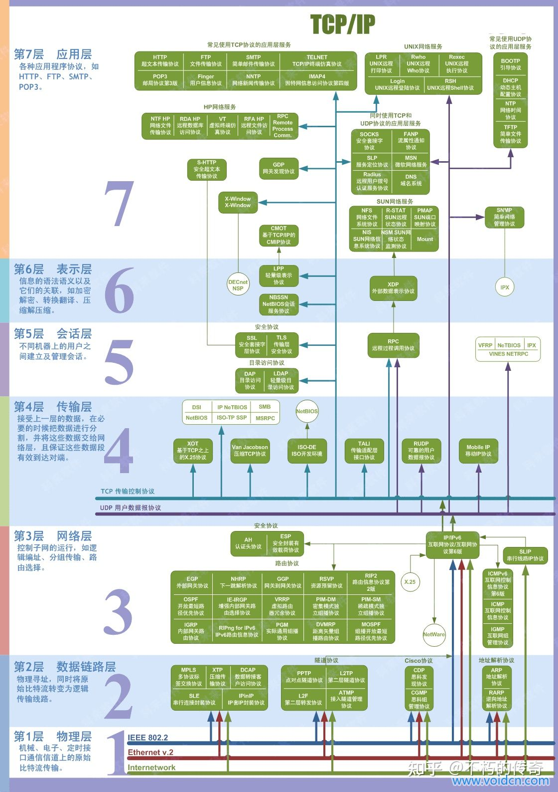

#### 浏览器从输入网址到页面显示，期间发生了什么？

- 解析URL（通信协议、目标域名、目标文件路径），生成HTTP报文
- DNS解析域名的IP地址（本地DNS服务器-根DNS服务器-顶级DNS服务器-权威DNS服务器）
  - 首先向本地DNS服务器查询目标服务器IP地址
  - 本地DNS服务器向根DNS服务器查询，根DNS服务器返回顶级DNS服务器IP地址
  - 本地DNS服务器向顶级DNS服务器查询，顶级DNS服务器返回权威DNS服务器IP地址
  - 本地DNS服务器向权威DNS服务器查询，顶级DNS服务器返回目标服务器IP地址
  - 本地DNS服务器向客户端返回目标服务器IP地址
- 客户端通过调用操作系统的Socket库的接口，委托TCP/IP协议栈完成数据包的收发工作
- TCP协议处理：三次握手、
- IP协议
- ARP协议
- 网卡驱动（物理层）把报文封装成数据帧，然后转换成电信号发送出去
- 交换机：工作在MAC层，故称二层网络设备，负责根据MAC地址将网络包原样转发至对应的端口连接的路由器
- 路由器：工作在网络层，故称三层网络设备

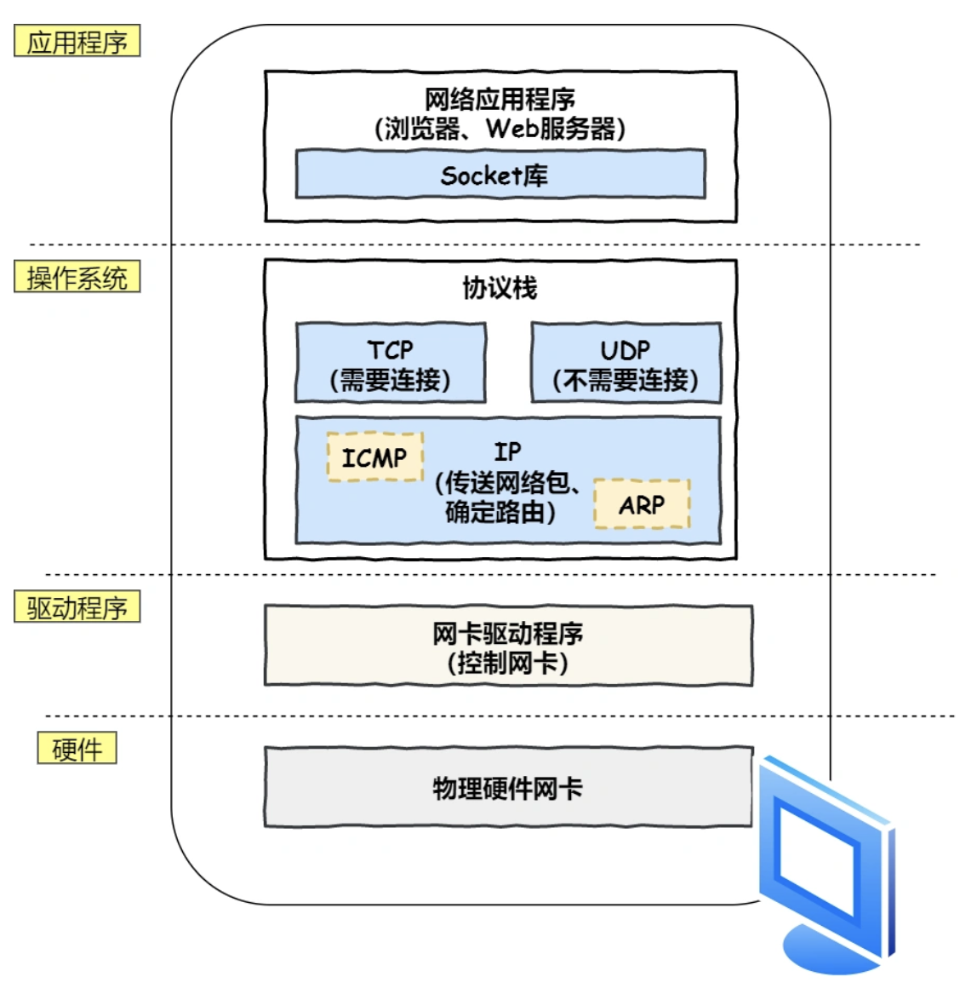

#### HTTP协议

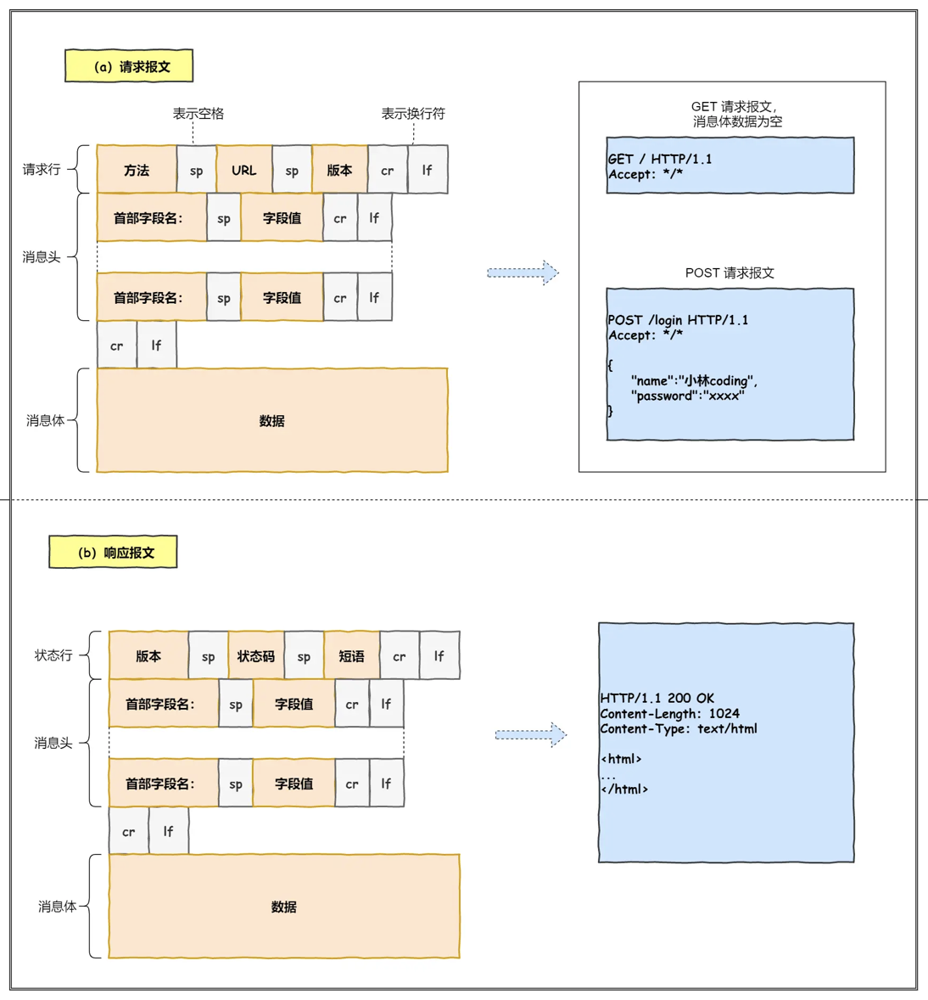

#### TCP协议

TCP(Transmission Control Protocol 传输控制协议)是一种**面向连接的**、**可靠的**、 **基于字节流的**传输层协议。

TCP 是一个工作在**传输层**的**可靠**数据传输的服务，它能确保接收端接收的网络包是**无损坏、无间隔、非冗余和按序的。**

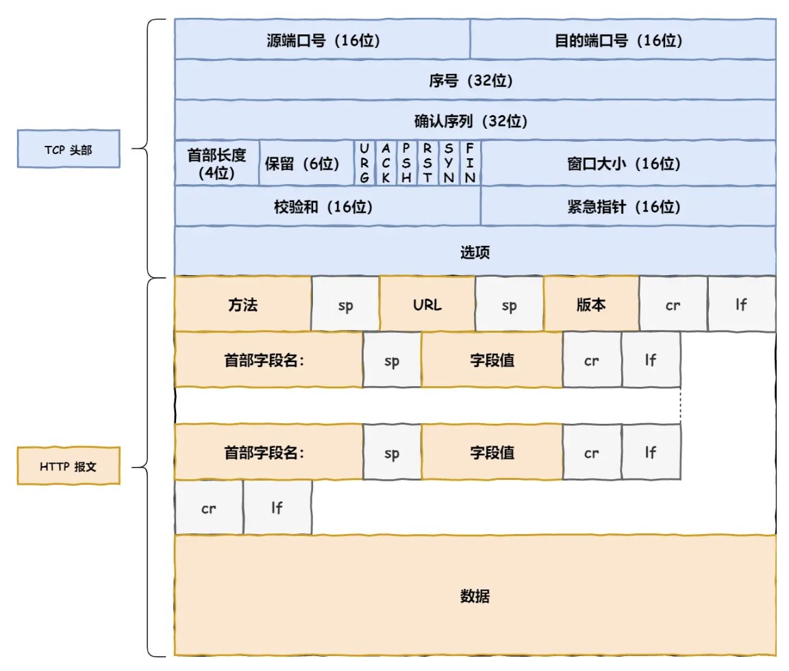

- 标志位：SYN、ACK、FIN等
- 源端口号和目标端口号
- 序号和确认号：确认号是序号加一
- 窗口大小：进行流量控制
- MTU和MSS，超过会拆包
- 三次握手

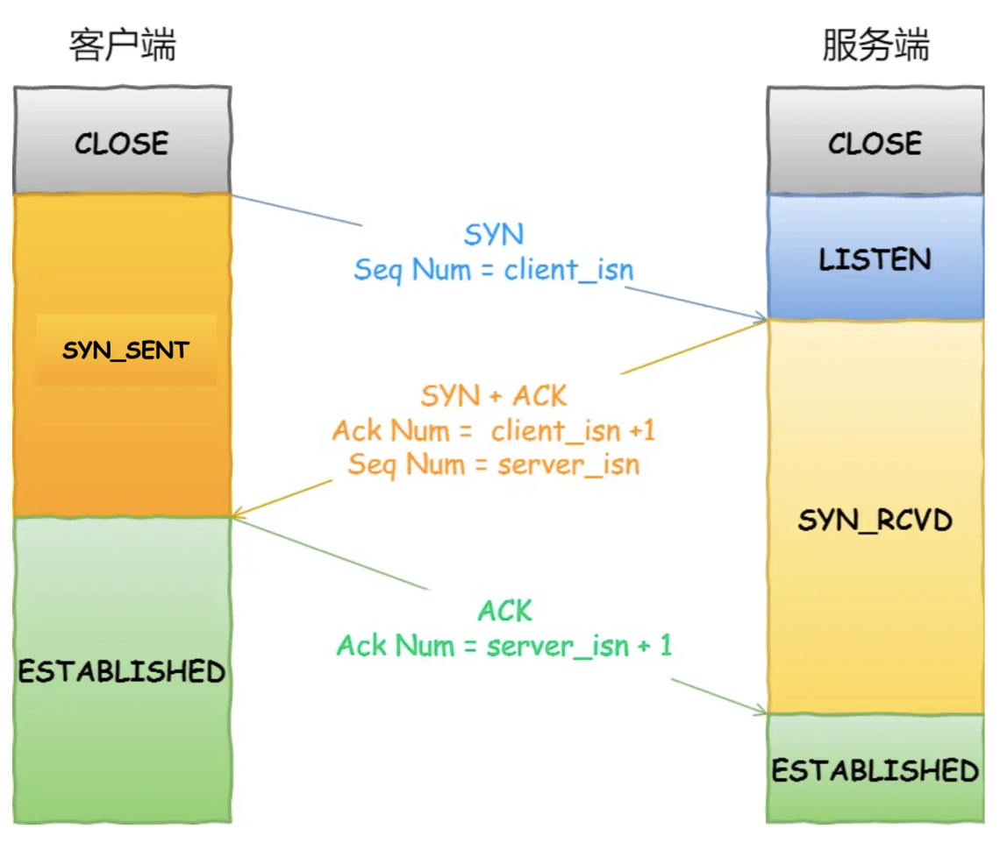

- 四次挥手

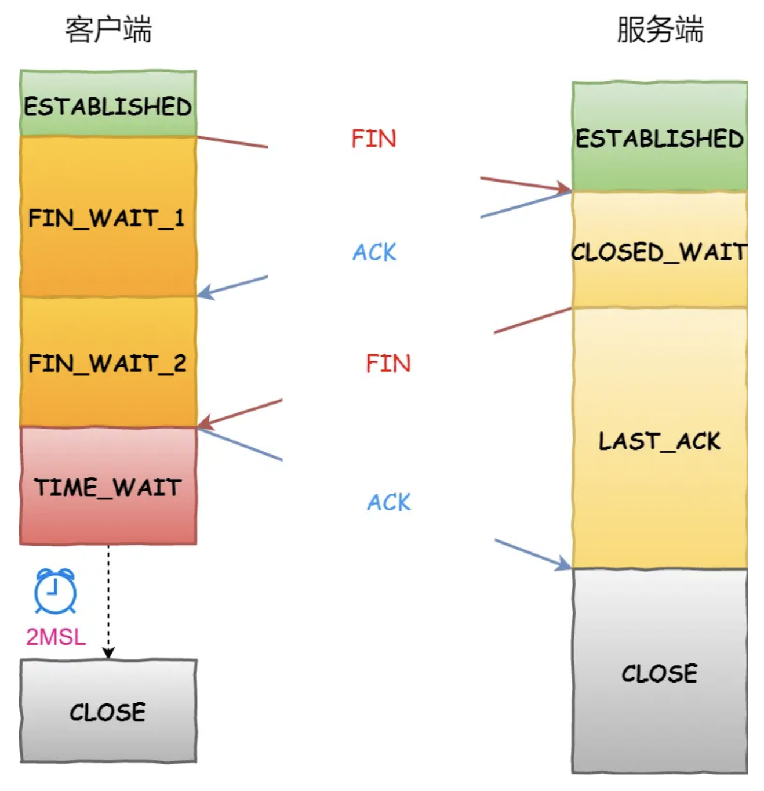

#### IP协议

定义

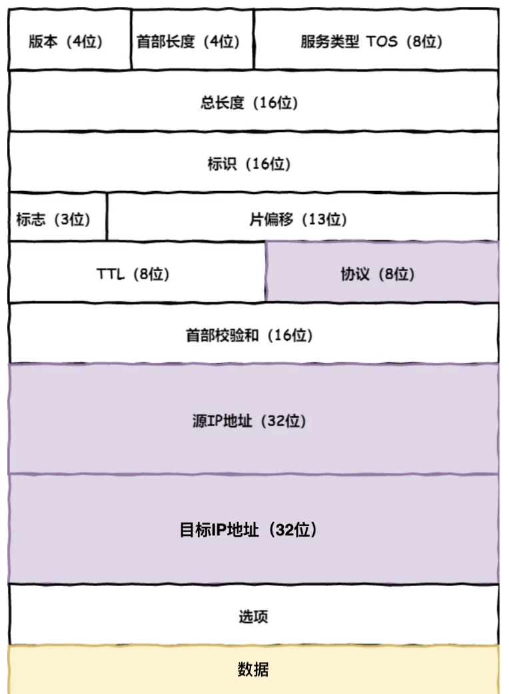

- 源IP地址和目标IP地址
- 路由表：包含下一跳的IP地址
- MAC地址：通过ARP协议广播得到下一跳IP地址对应的MAC地址

#### TCP/IP数据包格式

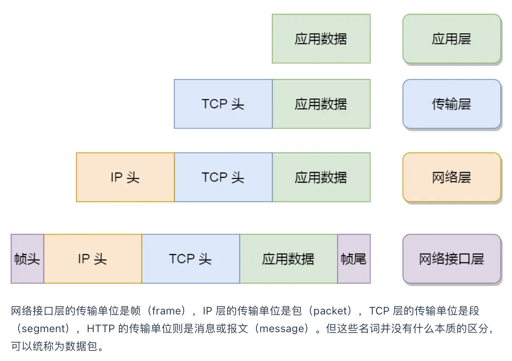

#### 服务端可支持的最大IP数

理论值=客户端IP数*客户端

实际值=受文件描述符数量、内存大小限制

#### **TCP 和 UDP 区别：**

*1. 连接*

- TCP 是面向连接的传输层协议，传输数据前先要建立连接。
- UDP 是不需要连接，即刻传输数据。

*2. 服务对象*

- TCP 是一对一的两点服务，即一条连接只有两个端点。
- UDP 支持一对一、一对多、多对多的交互通信

*3. 可靠性*

- TCP 是可靠交付数据的，数据可以无差错、不丢失、不重复、按序到达。
- UDP 是尽最大努力交付，不保证可靠交付数据。但是我们可以基于 UDP 传输协议实现一个可靠的传输协议，比如 QUIC 协议，具体可以参见这篇文章：[如何基于 UDP 协议实现可靠传输？(opens new window)](https://xiaolincoding.com/network/3_tcp/quic.html)

*4. 拥塞控制、流量控制*

- TCP 有拥塞控制和流量控制机制，保证数据传输的安全性。
- UDP 则没有，即使网络非常拥堵了，也不会影响 UDP 的发送速率。

*5. 首部开销*

- TCP 首部长度较长，会有一定的开销，首部在没有使用「选项」字段时是 `20` 个字节，如果使用了「选项」字段则会变长的。
- UDP 首部只有 8 个字节，并且是固定不变的，开销较小。

*6. 传输方式*

- TCP 是流式传输，没有边界，但保证顺序和可靠。
- UDP 是一个包一个包的发送，是有边界的，但可能会丢包和乱序。

*7. 分片不同*

- TCP 的数据大小如果大于 MSS 大小，则会在传输层进行分片，目标主机收到后，也同样在传输层组装 TCP 数据包，如果中途丢失了一个分片，只需要传输丢失的这个分片。
- UDP 的数据大小如果大于 MTU 大小，则会在 IP 层进行分片，目标主机收到后，在 IP 层组装完数据，接着再传给传输层。

# 重试机制

# 滑动窗口

窗口大小就是指**无需等待确认应答，而可以继续发送数据的最大值**。

TCP 头里有一个字段叫 `Window`，也就是窗口大小。**这个字段是接收端告诉发送端自己还有多少缓冲区可以接收数据。于是发送端就可以根据这个接收端的处理能力来发送数据，而不会导致接收端处理不过来。**所以，通常窗口的大小是由接收方的窗口大小来决定的。

# 流量控制

## 拥塞控制

> 为什么要有拥塞控制呀，不是有流量控制了吗？

前面的流量控制是避免「发送方」的数据填满「接收方」的缓存，但是并不知道网络的中发生了什么。

一般来说，计算机网络都处在一个共享的环境。因此也有可能会因为其他主机之间的通信使得网络拥堵。

> 那么怎么知道当前网络是否出现了拥塞呢？

其实只要「发送方」没有在规定时间内接收到 ACK 应答报文，也就是**发生了超时重传，就会认为网络出现了拥塞。**

> 拥塞控制有哪些控制算法？主要是四个算法：

- 慢启动
- 拥塞避免
- 拥塞发生
- 快速恢复

**慢启动**：慢启动的算法记住一个规则就行：一开始初始化 `cwnd = 1`，表示可以传一个 `MSS` 大小的数据。**当发送方每收到一个 ACK，拥塞窗口 cwnd 的大小就会加 1。**

**那慢启动涨到什么时候是个头呢？**

有一个叫慢启动门限 `ssthresh` （slow start threshold）状态变量。

- 当 `cwnd` < `ssthresh` 时，使用慢启动算法。
- 当 `cwnd` >= `ssthresh` 时，就会使用「拥塞避免算法」。

**拥塞避免算法**：拥塞避免算法就是将原本慢启动算法的指数增长变成了线性增长，还是增长阶段，但是增长速度缓慢了一些。

当触发了重传机制，也就进入了「拥塞发生算法」。

### 拥塞发生

当网络出现拥塞，也就是会发生数据包重传，重传机制主要有两种：

- 超时重传
- 快速重传

Cookie  和本地缓存？的区别？