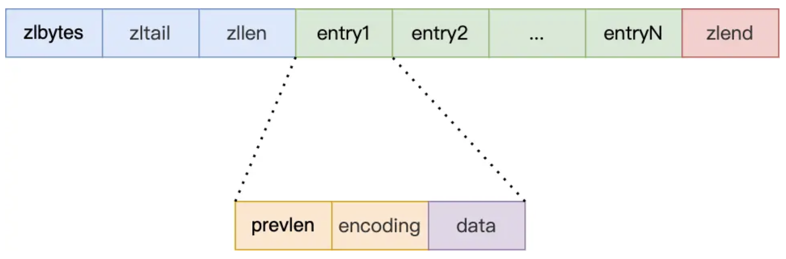
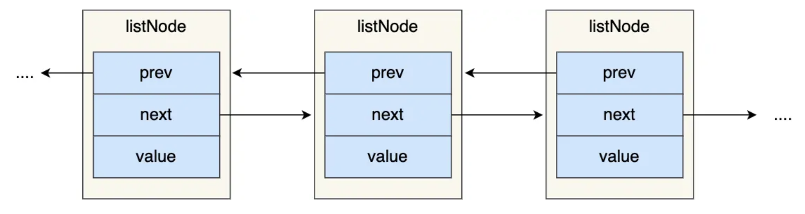
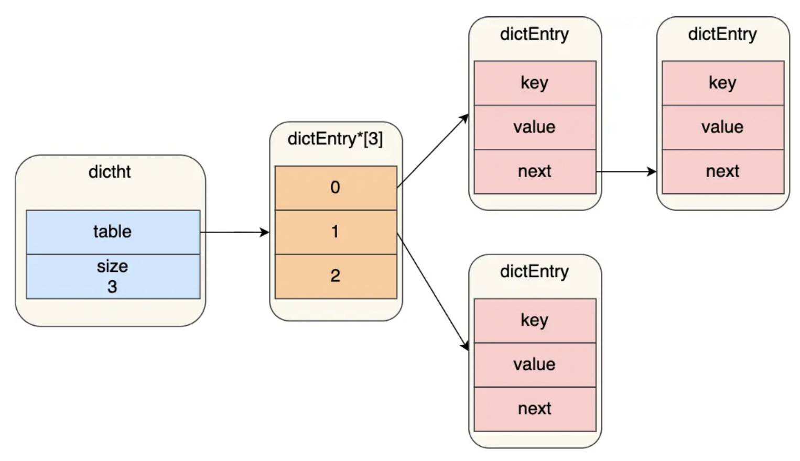
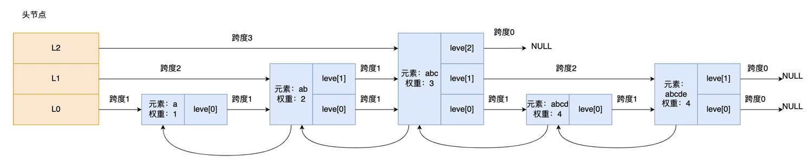
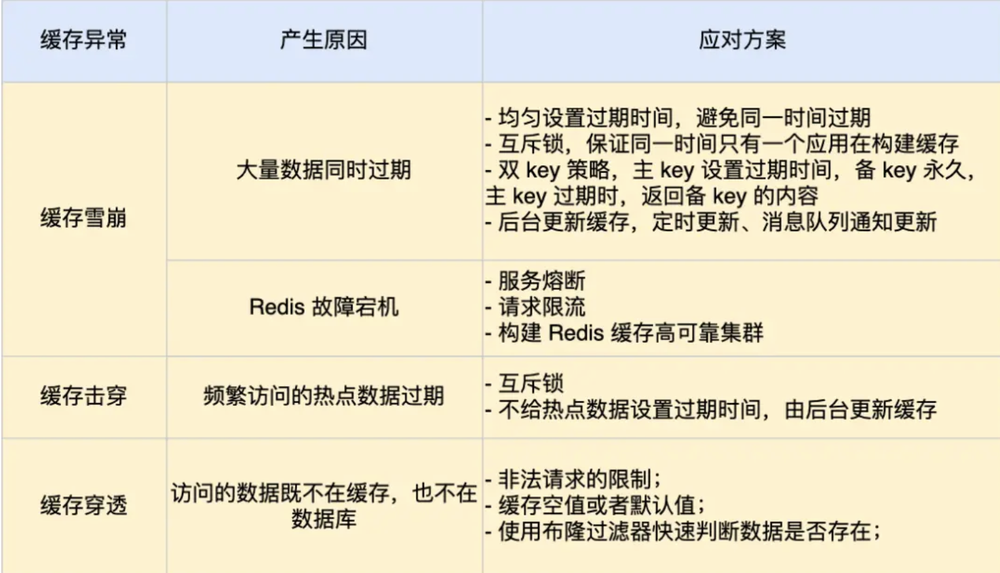
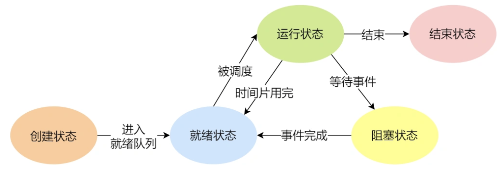

## 面试过程

#### 自我介绍

#### 介绍下你的项目

Mysql是在我的项目中如何使用的

业务的各种指标，数据规模

你的项目中用到了哪些技术？

你遇到了什么样的困难，怎么解决的呢？

你有什么要问面试官的问题？

做什么业务的

技术人员对业务的掌握要达到什么程度？转架构还是转业务？

#### 点

#### 2023-05-08 字节一面

自我介绍

介绍项目（为什么最后一步是查询结果、为什么用规则引擎、库表设计（要主动提到索引）是怎么样的数据量有多少、质量上是强制写单测吗、是为整个部门提供服务吗）（问项目有什么要补充的时候：没提到用了Redis做的分布式锁和缓存数据）

项目中的问题的问答讨论 安全校验的问题、风控

网络：三次握手四次挥手以及其中有什么状态能说多详细说多详细、TCP怎么保证是可靠的、怎么提高通信性能

Mysql索引应用题：最左匹配原则、范围查询索引失效

Redis：快的原因、单线程吗、内存淘汰策略、LRU具体怎么实现的存储了访问次数？什么时机进行缓存淘汰

设计一个feed流：推流、拉流、混合的模式

- 答问题的时候要前后连起来，一个点引导下一个点（有什么问题，什么新技术能解决，有什么优缺点），最好还能结合应用
- 答题的时候要提到一些技术词汇，例如LRU，再解释下实现原理

网络、mysql锁、redis、kafka、线程池和限流、内存、微服务、spring

算法题（leetcode、mysql）

项目

应用题（常规题）

设计模式

主要准备了MySQL、Redis、消息队列、zookeeper、分布式系统架构设计和docker。

MySQL 主要看了极客时间的 《MySQL 45讲》，关于事务、索引、锁以及 binlog 和 redolog 都讲的非常好，也是面试最爱考的，除此之外对数据库的读写分离、分库分表也要掌握。没有任何利益相关，决不是打广告。

Redis 主要看了《Redis 的设计与实现》，然后自己再总结了一下 Redis 的使用场景，以及 Redis 实现分布式锁基本 Redis 就没有问题了。

消息队列的开源软件比较多，我主要选择 Kafka 来学习，主要看官网文档，极客时间的《Kafka 核心技术与实战》，和一些技术文章等。不过极客时间的《Kafka 核心技术与实战》，我觉得讲的比较一般，不是很建议。

分布式系统的就准备CAP理论、BASE理论、**限流**、熔断、**一致性算法**、**主从架构、集群架构**、异地多活、负载均衡、分层架构、微服务等。

网络编程这块就包括 TCP/IP 协议，HTTP协议，网络安全三个方面。TCP/IP主要就是三次握手，四次挥手，TIME_WAIT 的作用等这些常考的题了。HTTP 协议考察 HTTP 协议的返回码、HTTP 的方法等。需要特别指出的是 HTTPS 加密的详细过程要非常透彻，不然容易产生一种感觉好像都清楚了，但是一问就有点说不清楚。最后就是网络安全，主要考察也是 WEB 安全，包括XSS，CSRF，SQL注入等。

## 问答题

#### **计算机网络**

1. 浏览器从输入网址到页面显示，期间发生了什么？（一个完整的 HTTP 请求会涉及到哪些协议？）
   1. 解析URL（通信协议、目标域名、目标文件路径），**生成HTTP报文**
   2. **DNS**解析域名的IP地址（本地DNS服务器-根DNS服务器-顶级DNS服务器-权威DNS服务器）
      - 首先向本地DNS服务器查询目标服务器IP地址
      - 本地DNS服务器向根DNS服务器查询，根DNS服务器返回顶级DNS服务器IP地址
      - 本地DNS服务器向顶级DNS服务器查询，顶级DNS服务器返回权威DNS服务器IP地址
      - 本地DNS服务器向权威DNS服务器查询，顶级DNS服务器返回目标服务器IP地址
      - 本地DNS服务器向客户端返回目标服务器IP地址

   3. 客户端通过调用操作系统的**Socket库接口**，委托TCP/IP协议栈完成数据包的收发工作
   4. **TCP协议**：三次握手
   5. **IP协议**
   6. **ARP协议**
   7. **网卡驱动**（物理层）把报文封装成数据帧，然后转换成电信号发送出去
   8. **交换机：**工作在MAC层，故称二层网络设备，负责根据MAC地址将网络包原样转发至对应的端口连接的路由器
   9. **路由器：**工作在网络层，故称三层网络设备
   10. 数据包在网络中跳跃，直至到达目标网络，然后找到目标服务器，最后协议栈处理数据并交给监听目标端口的进程
   11. 目标服务器将响应结果通过网络再返回给客户端

2. 
3. 介绍网络五层体系结构，每一层对应的网络协议有哪些？
   - 应用层（HTTP、DNS、FTP）、传输层（TCP、UDP）、网络层（IP、ARP、ICMP）、数据链路层、物理层
4. TCP、UDP差别？有哪些应用使用的是TCP协议，哪些应用使用的是UDP协议？
   - TCP 是**面向连接的、可靠的、基于字节流**的传输层通信协议。
   - UDP 不提供复杂的控制机制，利用 IP 提供面向「无连接」的即刻的通信服务。
   - **区别：**连接、服务对象、可靠性、拥塞控制、流量控制、首部开销、传输方式、分片不同（UDP是靠IP分片）
   - **TCP应用：**由于 TCP 是面向连接，能保证数据的可靠性交付，因此经常用于：FTP 文件传输、HTTP / HTTPS；
   - **UDP应用：**由于 UDP 面向无连接，它可以随时发送数据，再加上 UDP 本身的处理既简单又高效，因此经常用于：包总量较少的通信，如 DNS；音视频等多媒体通信； 广播通信；
5. TCP首部封装了哪些信息？TCP包头有哪些控制位？
   - 首部：源与目的端口号、序列号、应答号、首部长度、状态位（SYN、ACK、FIN、RST）、窗口大小、校验和、选项
6. **TCP三次握手过程以及状态**
   - 服务端状态：close、listen、syn_recv、established
   - 客户端状态：close、syn_sent、established
   - 三次握手：syn（序列号）、ack+syn（应答号+序列号）、ack（应答号）
   - 为什么不是二次握手
     - 三次握手才能保证双方具有接收和发送的能力
     - 避免服务端资源浪费
     - 可靠同步双方初始序列号
   - 为什么每次建立 TCP 连接时，初始化的序列号都要求不一样呢？
     - 为了防止历史报文被下一个相同四元组的连接接收（主要方面）；
     - 为了安全性，防止黑客伪造的相同序列号的 TCP 报文被对方接收；
   - 第一次握手丢失会发生什么？
   - 第二次握手丢失会发生什么？
   - 第三次握手丢失会发生什么？
7. **TCP四次挥手过程以及状态**
   - 服务端（被动方）状态：established、close_wait、last_ack、close
   - 客户端（主动方）状态：established、fin_wait_1、fin_wait_2、time_wait(2MSL)、close
   - 四次挥手：**fin、ack、fin、ack**
   - 第一次挥手丢失会发生什么？
   - 第二次挥手丢失会发生什么？
   - 第三次挥手丢失会发生什么？
   - 第四次挥手丢失会发生什么？
8. time_wait在哪一端产生，作用是什么 
   - 主动关闭连接的一端，才有 TIME_WAIT 状态
   - 作用：
     - 保证「被动关闭连接」的一方，能被正确的关闭；
     - 防止历史连接中的数据，被后面相同四元组的连接错误的接收；
9. 如果已经建立了连接，但是客户端突然出现故障了怎么办？——保活机制
10. **TCP怎么实现可靠的？**
11. **重传机制：**超时重传、快速重传、SACK、D-SACK
12. **TCP流量控制如何实现？**
13. **TCP拥塞控制如何实现？**慢启动、拥塞避免算法、拥塞发生算法、快速恢复算法
14. 路由转发过程介绍一下？
15. select 和 epoll的区别 
16. 
17. http与https的区别，加密怎么加的？ 非对称加密：RSA、ECDHE
18. HTTPS四次握手流程？为什么要四次？
19. http各种返回码，401和406啥区别？
20. WebSocket 与 Socket 的区别？

#### Mysql

- mysql 有那些存储引擎，有哪些区别
  - innodb 与myisam
  - 区别：索引、存储结构、事务、表锁差异、表总行数、范围查询、全文索引

- 索引分类（mysql是B+树）
  - 按「数据结构」分类：**B+tree索引、Hash索引、Full-text索引**
  - 按「物理存储」分类：**聚簇索引（主键索引）、二级索引（辅助索引）**
  - 按「字段特性」分类：**主键索引、唯一索引、普通索引、前缀索引**
  - 按「字段个数」分类：**单列索引、联合索引**
- 什么时候需要创建索引？
  - 字段有唯一性限制的，比如商品编码；
  - 经常用于 `WHERE` 查询条件的字段，这样能提高查询速度，如果查询条件不是一个字段，可以建立联合索引。
  - 经常用于 `GROUP BY` 和 `ORDER BY` 的字段，这样在查询的时候就不需要再去做一次排序了，因为我们都已经知道了建立索引之后在 B+Tree 中的记录都是排序好的。
- 什么时候不需要创建索引？
  - `WHERE` 条件，`GROUP BY`，`ORDER BY` 里用不到的字段，索引的价值是快速定位，如果起不到定位的字段通常是不需要创建索引的，因为索引是会占用物理空间的。
  - 字段中存在大量重复数据，不需要创建索引，比如性别字段，只有男女，如果数据库表中，男女的记录分布均匀，那么无论搜索哪个值都可能得到一半的数据。在这些情况下，还不如不要索引，因为 MySQL 还有一个查询优化器，查询优化器发现某个值出现在表的数据行中的百分比很高的时候，它一般会忽略索引，进行全表扫描。
  - 表数据太少的时候，不需要创建索引；
  - 经常更新的字段不用创建索引，比如不要对电商项目的用户余额建立索引，因为索引字段频繁修改，由于要维护 B+Tree的有序性，那么就需要频繁的重建索引，这个过程是会影响数据库性能的。
- 有什么优化索引的方法？
  - 覆盖索引优化；
  - 主键索引最好是自增的；
  - 防止索引失效；
  - 前缀索引优化；
- mysql 索引在什么情况下会失效 
  - 范围查询后不放在最后无法使用索引等不符合最左匹配原则的情况
  - 左或者左右的模糊匹配
  - 对索引列使用函数
  - 字符串和数字比较的时：如果字符串是索引列，而条件语句中的输入参数是数字时，索引列会发生隐式类型转换
  - OR 前的条件列是索引列，而在 OR 后的条件列不是索引列
- 乐观锁与悲观锁的区别？ 
- 事务的四大特性：ACID，原子性、隔离性、一致性、持久性
- MySQL 事务的四个隔离级别？ 先说了四个级别的区别，然后说了每个级别可能产生的问题 
  - 未提交读：脏读、不可重复读、幻读
  - 已提交读：不可重复读、幻读
  - 可重复度：幻读（Mysql没有）
  - 串行化：无
- MySQL InnoDB 引擎的默认隔离级别虽然是可重复读，怎么解决幻读的？
  - 针对**快照读**（普通 select 语句），**通过 MVCC 解决幻读**
  - 针对**当前读**（select ... for update 等语句），**通过 临键锁（记录锁+间隙锁）解决了幻读**
- 什么是MVCC？讲一讲MVCC的实现原理？
  - 数据行记录中有trx_id、roll_poiter，roll_poiter指向undo日志中该行记录的版本链
  - 对于「读提交」和「可重复读」隔离级别的事务来说，它们是通过 Read View 来实现的，它们的区别在于创建 Read View 的时机不同，「读提交」隔离级别是在「每个语句执行前」都会重新生成一个 Read View，而「可重复读」隔离级别是「启动事务时」生成一个 Read View，然后整个事务期间都在用这个 Read View。
  - Read View中包括四个重要字段：创建view时活跃事务 id 列表、创建view时最小活跃事务id `min_trx_id`、创建view时全局下一个事务id、创建该 view 的事务 id
  - 若行记录以及版本链中的事物id大于等于min_trx_id，则不可见，否则可见
- 
- 采用分库分表性能提升了多少知道吗？为什么要用分库分表？怎么解决分库导致的分布式事务问题？分库分表怎么查询的
- 
- MySQL 一条语句的执行有哪些过程
  - 连接池、查询缓存、解析器、预处理器、优化器、执行器、存储引擎内存或磁盘查询、返回结果
- MySQL 如何分析一条语句的执行过程
  - explain
- delete from t1 limit 3和delete from t1的区别？
- 
- redo log 和 binlog 有什么区别？
  - 适用对象不同：binlog 是 MySQL Server 层实现的日志，所有存储引擎都可以使用；redo log 是 Innodb 层的日志；
  - 文件格式不同：
    - binlog 有 3 种格式类型，分别是 STATEMENT（默认格式）、ROW、 MIXED
    - redo log 是物理日志，记录的是在磁盘中的哪个数据页做了什么修改
  - 写入方式不同：
    - binlog 是追加写，写满一个文件就创建一个新的文件继续写，不会覆盖以前的日志，保存的是全量的日志。
    - redo log 是循环写，日志空间大小是固定，全部写满就从头开始，保存未被刷入磁盘的脏页日志。
  - 用途不同：binlog 用于备份恢复、主从复制；redo log 用于掉电等故障恢复。
- 两阶段提交 
  - **MySQL 为了避免出现binlog和redolog 之间的逻辑不一致的问题，使用了「两阶段提交」来解决**，两阶段提交其实是分布式事务一致性协议，它可以保证多个逻辑操作要不全部成功，要不全部失败，不会出现半成功的状态。
  - **准备阶段**：写入redolog，redolog中事务状态为prepare
  - **提交阶段**：写入binglog，提交事物，redolog中事务状态变为commit
- mysql 主从同步怎么搞的？分哪几个过程？如果有一台新机器要加到从机里，怎么个过程
  - 主库logdump线程将binglog推送到从库的io线程，先放入relaylog中，然后从库的log线程读取sql写入库中
  - 三个过程：**写入 Binlog**、**同步 Binlog**、**回放 Binlog**
  - **写入 Binlog**：主库写 binlog 日志，提交事务，并更新本地存储数据。
  - **同步 Binlog**：把 binlog 复制到所有从库上，每个从库把 binlog 写到暂存日志中。
  - **回放 Binlog**：回放 binlog，并更新存储引擎中的数据。
- 说一下读写分离，如果有数据库延迟怎么办？主从延迟

#### Redis

- Redis是单线程的吗？
  - 不是，Redis有网络IO和数据读写线程、异步释放内存的 lazyfree 线程、AOF 刷盘线程、关闭文件线程。
- Redis 采用单线程为什么还这么快？
  - Redis 的大部分操作**都在内存中完成**，并且采用了高效的数据结构
  - Redis 采用单线程模型可以**避免多线程之间的竞争**，省去了多线程切换带来的时间和性能上的开销
  - Redis 采用了 **I/O 多路复用机制**来处理大量的客户端 Socket 请求
- redis 数据结构有哪些？分别怎么实现的？ 
  - Redis有丰富且高效的数据结构，**string(字符串)、list (列表)、hash(哈希)、set(集合)、zset(有序集合)、**Bitmaps（位图）、HyperLogLog（基数统计）、GEO（地理信息）、Stream（流）
  - **string(字符串)**——SDS
  - **list (列表)**——压缩列表-->NULL、双向链表-->quicklist
  - **hash(哈希)**——压缩列表-->listpack、哈希表
  - **set(集合)**——哈希表、整数集合
  - **zset(有序集合)**——压缩列表-->listpack、跳表
- Redis String类型的底层是如何实现？为什么Redis要用简单动态字符串 SDS？
  - RedisObject中保存类型、编码方式、指针，指针指向SDS

- 压缩列表数据结构
  - 压缩列表**由连续内存块组成的顺序型数据结构**，有点类似于数组；
  - ==listpack==在压缩列表基础上每个节点不再记录前一个节点长度，解决了连锁更新问题

- 链表数据结构
  - 有前置节点和后置节点，可以看的出，这个是一个双向链表
  - ==quicklist==在链表基础上每个Node变成一个压缩列表

- 哈希表数据结构
  - 渐进式rehash实现过程？

- redis zset有用过吗，原理是什么样的？压缩列表原理，跳表原理
  - 跳表原理：**跳表是在链表基础上改进过来的，是一种「多层」的有序双向链表**，好处是能快读定位数据。
  - 为什么Sorted set底层不用二叉树，平衡树实现？范围查找、空间大小、实现简单

- Redis数据结构的常见应用场景？

  - string： 缓存对象、计数器、分布式锁、共享 session 信息等；
  - list： 链表、队列、微博关注人时间轴列表等，消息队列；
  - hash： Hash 表、缓存对象（用户信息）、购物车等；
  - set：聚合计算（并集、交集、差集）场景，比如去重、点赞、共同关注/好友、抽奖活动等；
  - zset： 排序场景，访问量排行榜、点击量排行榜等；
  - BitMaps：二值状态统计的场景，比如签到、判断用户登陆状态、连续签到用户总数等；

  - HyperLogLog：海量数据基数统计的场景，比如百万级网页 UV 计数等；

  - GEO：存储地理位置信息的场景，比如滴滴叫车；

  - Stream：消息队列，相比于基于 List 类型实现的消息队列：自动生成全局唯一消息ID，支持以消费组形式消费数据。

- Redis key 的过期删除策略有哪些，优点和缺点是什么？
  - Redis采用的是惰性删除策略 + 定期删除策略
  - 惰性删除策略：在访问某一个key的时候才判断是否过期，如果过期，删除之
  - 定期删除策略：每隔一段时间「随机」从数据库中取出一定数量的 key 进行检查，删除过期key

- Redis key 的内存淘汰策略有哪些，优点和缺点是什么？
  - 当key在内存中的总数据大小超过阈值时候触发内存淘汰，共有八种内存淘汰策略
    1. 不进行数据淘汰：内存满了的时候，直接向客户端报错（Redis3.0之后的默认策略）
    2. **volatile-random**：在所有设置了过期时间的键值中，随机淘汰任意键值
    3. **volatile-ttl**：优先淘汰更早过期的键值。
    4. **volatile-lru**：在所有设置了过期时间的键值中，淘汰最久未使用的键值；
    5. **volatile-lfu**：在所有设置了过期时间的键值中，淘汰最少使用的键值；
    6. **allkeys-random**：在所有key中，随机淘汰任意键值;
    7. **allkeys-lru**：在所有key中，淘汰最久未使用的键值；（Redis 对象头中记录 key 的访问时间戳）
    8. **allkeys-lfu**：在所有key中，淘汰最少使用的键值；（Redis 对象头中记录 key 的访问频次）

  - LRU：最近最少使用(最长时间)淘汰算法（Least Recently Used），LRU是淘汰最长时间没有被使用的数据。
  - LFU：最不经常使用(最少次)淘汰算法（Least Frequently Used），LFU是淘汰一段时间内，使用次数最少的数据。

- Redis 持久化有哪几种方式，怎么选？ 
  - AOF 和 RDB，以及混合模式
  - AOF：将每次对键值对的读写命令记录到日志文件中，是增量追加
  - RDB：将内存中的全量键值对数据以二进制的方式记录到日志文件中，是全量快照
  - 混合模式：结合RDB和AOF，日志文件前一半是RDB后一半是AOF

- 如果我想要数据不能丢失，如何让RDB和AOF混合使用来满足我的诉求？
  - 开启混合持久化，AOF 文件的**前半部分是 RDB 格式的全量数据，后半部分是 AOF 格式的增量数据**。

- 如果我采取AOF持久化方式，并且想要高可靠性保证，选择哪一种写回策略，为什么？
  - 日志缓存刷盘的写回策略设置为：Always同步写回

- 

- 缓存更新策略——Cache Aside（旁路缓存）策略

  - 写策略：先更新数据库，后更新缓存
  - 读策略：先读缓存，若没有命中，查询数据库，会写缓存

- Redis的事务能实现ACID属性吗？

  - Redis事务：是原子的但不保证原子性，没有隔离级别，不支持事务回滚
  - Redis事务三阶段：开始事务、命令入队、执行事务。若期间一个命令报错，顺序执行后续命令。
  - Watch key [key ...]： `WATCH`命令的使用是为了解决 `事务并发` 产生的`不可重复读`和`幻读`的问题。该命令为指定监视某个对象，只能在MULTI命令之前执行.如果监视的对象被其他客户端修改，当执行Exec命令时将会放弃事务执行队列中的所有操作命令，并直接向客户端返回(nil)表示事务执行失败。`(Watch可以当做Redis乐观锁操作，每次更新数据时都会去判断一下，在此期间是否有人修改过这个数据)`

- 

- Redis如何实现高可用 ？

  - 多服务节点：主从复制、哨兵模式、切片集群
  - 主从复制：将 Redis 服务器的数据同步到多台从服务器上，即一主多从模式，且主从服务器之间「读写分离」
  - 哨兵模式(Redis Sentinel)：哨兵模式做到了可以监控主从服务器，并且提供**主从节点故障转移的功能。**
  - 切片集群(Redis Cluster)：当 Redis 缓存数据量大到一台服务器无法缓存时，就需要使用 Redis 切片集群方案，它将数据分布在不同的服务器上，以此来降低系统对单主节点的依赖，从而提高 Redis 服务的读写性能。

- Redis 主从同步是怎样的过程？ 

    - 全量同步（第一次同步）：

        - 第一阶段：主从之间建立连接，然后协商进行全量同步

        - 第二阶段：主服务器执行 bgsave 命令生成 RDB 文件，然后把RDB文件发送给从服务器，从服务器丢弃所有旧数据，然后加载RDB文件，最后回复一个确认消息给主服务器

        - 第三阶段：主服务器将缓冲区里记录的写操作命令发给从服务器，从服务器执行这些写命令，完成数据同步

    - 命令传播：主从服务器在完成第一次同步后，双方之间就会维护一个 TCP 连接。后续进行增量同步。

    - 增量同步：中间长链接断开并重连后，同步这期间的增量数据

- 分布式系统的一致性哈希算法与Redis哈希槽原理的区别

- 

- 什么是热点Key？热点key有什么问题？如何解决热点Key？

  - 热点数据动态缓存的策略总体思路：**通过数据最新访问时间来做排名，并过滤掉不常访问的数据，只留下经常访问的数据**。

  - 以电商平台场景中的例子，现在要求只缓存用户经常访问的 Top 1000 的商品。具体细节如下：

    - 先通过缓存系统做一个排序队列（比如存放 1000 个商品），系统会根据商品的访问时间，更新队列信息，越是最近访问的商品排名越靠前；
    - 同时系统会定期过滤掉队列中排名最后的 200 个商品，然后再从数据库中随机读取出 200 个商品加入队列中；
    - 这样当请求每次到达的时候，会先从队列中获取商品 ID，如果命中，就根据 ID 再从另一个缓存数据结构中读取实际的商品信息，并返回。
    - 在 Redis 中可以用 zadd 方法和 zrange 方法来完成排序队列和获取 200 个商品的操作。

    

- 什么是大key？大key有什么坏处，如何解决大key？

  - 大key是指 key 对应的 value 所占的空间很大，例如：String 类型的值大于 10 KB；集合元素的个数超过 5000个；
  - 大 key 会造成什么问题？
    - **客户端超时阻塞**。由于 Redis 执行命令是单线程处理，然后在操作大 key 时会比较耗时，那么就会阻塞 Redis，从客户端这一视角看，就是很久很久都没有响应。
    - **引发网络阻塞**。每次获取大 key 产生的网络流量较大，如果一个 key 的大小是 1 MB，每秒访问量为 1000，那么每秒会产生 1000MB 的流量，这对于普通千兆网卡的服务器来说是灾难性的。
    - **阻塞工作线程**。如果使用 del 删除大 key 时，会阻塞工作线程，这样就没办法处理后续的命令。
    - **内存分布不均**。集群模型在 slot 分片均匀情况下，会出现数据和查询倾斜情况，部分有大 key 的 Redis 节点占用内存多，QPS 也会比较大。
  - 如何解决大key？1.把大 key 拆分成一个一个小 key；2.定期用unlink删除大key（如果可以删除）；
  - 如何删除大 key？（如果一下子释放了大量内存，会造成 Redis 主线程的阻塞）
    - 分批次删除：对于集合类型的大key可以分批次删除其中的元素
    - 异步删除：**用 unlink 命令代替 del 来删除**

- 

- 缓存雪崩、击穿、穿透

- 缓存用过吗，你们redis有用在哪些场景？
- Redis分布式锁怎么实现的（`SET lock_key unique_value NX PX 10000`）
  - Redis 的 SET 命令有个 NX 参数可以实现「key不存在才插入」，所以可以用它来实现分布式锁

    - 如果 key 不存在，则显示插入成功，可以用来表示线程加锁成功；
    - 如果 key 存在，则会显示插入失败，可以用来表示线程加锁失败。

  - 锁变量需要设置过期时间 EX/PX，导致锁一直无法释放，影响后续程序执行

  - 基于 Redis 实现分布式锁有什么优点？

    - 性能高效（这是选择缓存实现分布式锁最核心的出发点）。
    - 实现方便。很多研发工程师选择使用 Redis 来实现分布式锁，很大成分上是因为 Redis 提供了 setnx 方法，实现分布式锁很方便。
    - 避免单点故障（因为 Redis 是跨集群部署的，自然就避免了单点故障）。

  - 基于 Redis 实现分布式锁有什么缺点？

    - 超时时间不好设置。如果锁的超时时间设置过长，会影响性能，如果设置的超时时间过短会保护不到共享资源。比如在有些场景中，一个线程 A 获取到了锁之后，由于业务代码执行时间可能比较长，导致超过了锁的超时时间，自动失效，注意 A 线程没执行完，后续线程 B 又意外的持有了锁，意味着可以操作共享资源，那么两个线程之间的共享资源就没办法进行保护了。
    - 那么如何合理设置超时时间呢？我们可以基于续约的方式设置超时时间：先给锁设置一个超时时间，然后启动一个守护线程，让守护线程在一段时间后，重新设置这个锁的超时时间。实现方式就是：写一个守护线程，然后去判断锁的情况，当锁快失效的时候，再次进行续约加锁，当主线程执行完成后，销毁续约锁即可，不过这种方式实现起来相对复杂。
    - Redis 主从复制模式中的数据是异步复制的，这样导致分布式锁的不可靠性。如果在 Redis 主节点获取到锁后，在没有同步到其他节点时，Redis 主节点宕机了，此时新的 Redis 主节点依然可以获取锁，所以多个应用服务就可以同时获取到锁。
  - Redis 如何解决集群情况下分布式锁的可靠性？——Redlock（红锁）
- zset 延时队列怎么实现的 
  - 使用 zadd score1 value1 命令就可以一直往内存中生产消息，其中score1就是延迟后的时间，再利用 zrangebysocre 查询符合条件的所有待处理的任务，通过循环执行队列任务即可。
  - 同时考虑使用 Redis RDB+AOF 进行数据持久化，Redis 的哨兵实现故障转移，切片集群来抗高并发
  - 另一个方法是使用时间轮？？
- Redis 的 ZSET 做排行榜时，如果要实现分数相同时按时间顺序排序怎么实现？ 说了一个将 score 拆成高 32 位和低 32 位，高 32 位存分数，低 32 位存时间的方法。问还有没有其他方法，想不出了？？

#### Kafka

- kafka是什么
- kafka 为什么可以扛住这么高的qps 
- kafka partition broker consumer consumer group topic 等都是啥关系？ 
- kafka 分区怎么同步的
- kafka 怎么保证不丢消息的
- 
- Kafka 选主怎么做的？ raft算法和zk选主算法 
- kafka 与 rabbitmq区别 
- 
- 微服务的特点，如何实现服务发现和负载均衡 

#### 多线程

- 协程和线程的区别 
  - 线程公有数据：相同的虚拟内存和全局变量
  - 线程私有数据：栈和寄存器

- 线程有哪些状态？如何切换的？

- 进程间通讯方法 ：管道、消息队列、共享内存、信号量、信号
  - 信号是进程间通信机制中**唯一的异步通信机制**，因为可以在任何时候发送信号给某一进程，一旦有信号产生，我们就有下面这几种，用户进程对信号的处理方式。**执行默认操作**、**捕捉信号**、**忽略信号**。
  - **Socket 通信**：实际上，Socket 通信不仅可以跨网络与不同主机的进程间通信，还可以在同主机上进程间通信。
- 介绍一下缓存 
- 查看 CPU 的命令和磁盘 IO 的命令
- 线程池了解吗？有哪些参数？ 
- 用户空间和内核空间的区别？ 
- sleep() 方法和 wait() 方法区别?
- 偏向锁是什么？轻量级锁是什么？
- 讲一讲synchronized锁升级过程？
- CAS了解多少？
- ReentrantLock公平锁实现原理？
- ReentrantLock非公平锁实现原理？
- 线程池有哪些核心参数？
- 讲讲线程池的工作方式？
- 如果线程到达 maximumPoolSize 仍然有新任务来临，并且该任务的优先级比较高，不允许直接丢弃，希望该任务立即执行，如何处理？
- 死锁如何处理

#### Java

- 了解哪些集合？
- ArrayList和LinkedList区别？线程安全如何？ 
- HashMap 和 TreeMap 的区别？
- HashMap jdk8与jdk7区别？
- HashMap为什么线程不安全？哪种HashMap是线程安全的？ConcurrentHashMap 的1.7版本和1.8版本的实现原理？CAS机制在ConcurrentHashMap有哪些具体体现？ConcurrentHashMap为什么在1.7使用分段锁，1.8使用CAS + synchronized？hashMap的死锁和优化
- synchronized修饰静态方法和实例方法锁的是什么？ 

- Java的内存模型，有哪些部分？ 内存调优？堆和栈的地址增长方向？ 

- 讲一讲类加载过程 ，为什么用双亲委派模型？
  - 启动类加载器、扩展类加载器、应用程序类加载器
- GC？讲一讲垃圾回收器中新生代老年代？ 垃圾收集算法标记清除和标记整理是怎样的？ 

- 静态内部类的特点

- 类与类之间的关联性是如何在开发中体现的（他想问的是使用一个类存储另一个类的作为成员函数，我兜兜转转了半天，勉强算答对一半

- Java 反射机制？

- 异常和错误的区别？举几个遇到过的异常？内存溢出属于什么？为什么内存会溢出？

- λ函数创建的内部类对于内存的影响？stream api的应用

  

#### **Spring**

  - 讲一下Spring中的bean生命周期？

  - 讲一下Spring事务的传播机制？

  - 有时候在一个大的事务中，需要执行一些小的业务操作，这些小的业务操作可以单独成功或失败，不影响大的事务，这属于哪种事务传播机制？

  - 如果当前存在事务，则使用当前事务，如果当前不存在事务，则无事务执行，这属于哪种事务传播机制？

    

#### 分布式

- 负载均衡算法有哪些 

- 服务发现是怎么实现的 

- 熔断是怎么实现的 

- id生成器怎么实现的，如何实现全局递增 

- 如果用户量上涨怎么优化 

- 负载均衡的加权轮询算法怎么实现 

- 让你设计一个限流的系统怎么做？ 令牌桶 

- rpc框架的理解，

- 微服务通信机制，可靠性

- 谈谈分布式事务

#### 设计模式

- 我熟悉哪些软件设计原则，这些原则是在我的软件开发中是如何使用的
- 单例模式

2023面试题  链接: https://pan.baidu.com/s/16thFchn9wWSZ3cwClXjSPA 提取码: 8888

公开课笔记：链接：https://pan.baidu.com/s/1OxIRV03qRN4Ehxsi_bI3cQ   提取码：o9yc
 面试最新资料   链接：https://pan.baidu.com/s/1m7JRnPp9apmWCoNVLa2_AQ    提取码：6666
“java高分面试-25大专题”以及“Java进阶架构核心知识集”. 链接：https://pan.baidu.com/s/1wwN5JBm_ayqrbXliti2vXw   提取码：6666 
Java岗核心面试题 链接：https://pan.baidu.com/s/1JxQ2WCUxcHtNvW46IR_q8g   提取码：6666

三面

1. 对未来的规划有哪些？
2. 现在还在字节实习吗？在哪里租的房子？
3. 选择一家公司最看中的一个因素是什么？为什么？
4. 自己身上的优点和缺点有哪些？
5. 最近有关注哪些技术热点和阅读哪些技术书籍？
6. 为什么写博客？什么时候开始写博客的？
7. 有没有考研的想法，为什么？
8. 遇到的最大的一个困难是什么？如何解决的？
9. 介绍一下三段实习分别做了哪些工作？
10. 介绍一下在字节实习做的业务和方向？
11. 对广告投放系统了解多少？
12. 如果让你设计一个广告投放系统，你会怎么考虑？
13. 共享屏幕，画一下广告系统整体链路架构图？
14. 介绍一下字节实习部门在整个广告系统的位置，以及为什么需要这个部门？
15. 结合实习经历，讲一下对设计模式的理解？